# Introduction
Hazelcast is a clustering and highly scalable data distribution platform for Java. Hazelcast helps architects and developers to easily design and develop faster, highly scalable and reliable applications for their businesses.

-   Distributed implementations of `java.util.{Queue, Set, List, Map}`

-   Distributed implementation of `java.util.concurrent.ExecutorService`

-   Distributed implementation of `java.util.concurrency.locks.Lock`

-   Distributed `Topic` for publish/subscribe messaging

-   Transaction support and J2EE container integration via JCA

-   Distributed listeners and events

-   Support for cluster info and membership events

-   Dynamic HTTP session clustering

-   Dynamic clustering

-   Dynamic scaling to hundreds of servers

-   Dynamic partitioning with backups

-   Dynamic fail-over

-   Super simple to use; include a single jar

-   Super fast; thousands of operations per sec.

-   Super small; less than a MB

-   Super efficient; very nice to CPU and RAM

To install Hazelcast:

-   Download hazelcast-\_version\_.zip from [www.hazelcast.com](http://www.hazelcast.com)

-   Unzip hazelcast-\_version\_.zip file

-   Add hazelcast.jar file into your classpath

Hazelcast is pure Java. JVMs that are running Hazelcast will dynamically cluster. Although by default Hazelcast will use multicast for discovery, it can also be configured to only use TCP/IP for environments where multicast is not available or preferred ([Click here for more info](#ConfigTcpIp)). Communication among cluster members is always TCP/IP with Java NIO beauty. Default configuration comes with 1 backup so if one node fails, no data will be lost. It is as simple as using`java.util.{Queue, Set, List, Map}`. Just add the hazelcast.jar into your classpath and start coding.


## What's new in 3.0?

**Core architecture:**

-   Multi-thread execution: Operations are now executed by multiple threads (by factor of processor cores). With Hazelcast 2, there was a only single thread.
-   SPI
    : Service Programming Interface for developing new partitioned services, data structures. All Hazelcast data structures like Map, Queue are reimplemented with SPI.

**Serialization**

-   IdentifiedDataSerializable
    : A slightly optimized version of DataSerializable that doesn't use class name and reflection for de-serialization.
-   Portable Serialization
    : Another Serialization interface that doesn't use reflection and can navigate through binary data and fetch/query/index individual field without having any reflection or whole object de-serialization.
-   Custom Serialization
    : Support for custom serialization that can be plugged into Hazelcast.

**Map**

-   Entry Processor
    : Executing an EntryProcessor on the key or on all entries. Hazelcast implicitly locks the entree and guarantees no migration while the execution of the Processor.
-   In Memory Format
    : Support for storing entries in Binary, Object and Cached format.
-   Continuous Query
    : Support for listeners that register with a query and are notified when there is a change on the Map that matches the Query.
-   Interceptors
    : Ability to intercept the Map operation before/after it is actually executed.
-   Lazy Indexing
    :Ability to index existing items in the map. No need to add indexes at the very beginning.

**Queue**

-   No more dependency on the distributed map
-   Scales really well as you have thousands of separate queues.
-   Persistence
    Support for persistence with QueueStore.

**Multimap**

-   Values can be Set/List/Queue.

**Topic**

-   Total Ordering : Support for global ordering where all Nodes receive all messages in the same order.

**Transactions**

-   Distributed Transaction
    : Support for both 1-phase (local) and 2 phase transactions with a totally new API.

**Client**

-   New Binary Protocol: A new binary protocol based on portable serialization. The same protocol is used for Java/C/C\# and other client
-   Smart client: Support for dummy and smart client. Where a dummy client will maintain a connection to only one member, whereas the smart client can route the operations to the Node that owns the data.


## Upgrading from 2.x versions


In this section, we list the changes what users should take into account before upgrading to Hazelcast 3.0 from earlier versions of Hazelcast.

-   Removal of deprecated static methods:
    The static methods of Hazelcast class reaching hazelcast data components have been removed. The functionality of these methods can be reached from HazelcastInstance interface. Namely you should replace following:

```java
Map<Integer, String> mapCustomers = Hazelcast.getMap("customers");
```
    with

```java
HazelcastInstance instance = Hazelcast.newHazelcastInstance(cfg);
// or if you already started an instance
// HazelcastInstance instance = Hazelcast.getHazelcastInstanceByName("instance1");
Map<Integer, String> mapCustomers = instance.getMap("customers");
```
-   Removal of lite members:
    With 3.0 there will be no member type as lite member. As 3.0 clients are smart client that they know in which node the data is located, you can replace your lite members with native clients.

-   Renaming "instance" to "distributed object":
    Before 3.0 there was a confusion for the term "instance". It was used for both the cluster members and the distributed objects (map, queue, topic etc. instances). Starting 3.0, the term instance will be only used for hazelcast instances, namely cluster members. We will use the term "distributed object" for map, queue etc. instances. So you should replace the related methods with the new renamed ones: As 3.0 clients are smart client that they know in which node the data is located, you can replace your lite members with native clients.

```java
    public static void main(String[] args) throws InterruptedException {
        Config cfg = new Config();
        HazelcastInstance hz = Hazelcast.newHazelcastInstance(cfg);
        IMap map = hz.getMap("test");
        Collection<Instance> instances = hz.getInstances();
        for (Instance instance : instances) {
            if(instance.getInstanceType() == Instance.InstanceType.MAP) {
            System.out.println("there is a map with name:"+instance.getId());
            }
        }
    }
```
    with

```java
    public static void main(String[] args) throws InterruptedException {
        Config cfg = new Config();
        HazelcastInstance hz = Hazelcast.newHazelcastInstance(cfg);
        IMap map = hz.getMap("test");
        Collection<DistributedObject> distributedObjects = hz.getDistributedObjects();
            for (DistributedObject distributedObject : distributedObjects) {
                if(distributedObject instanceof IMap)
                System.out.println("there is a map with name:"+distributedObject.getName());
            }
    }
```
-   Package structure change:
    PartitionService has been moved to package "com.hazelcast.core" from "com.hazelcast.partition"

-   Listener API change:
    Before 3.0, you can removeListener methods was taking the Listener object as parameter. But it causes confusion as same listener object may be used as parameter for different listener registrations. So we have changed the listener API. Anymore, addListener methods return you an unique id and you can remove listener by using this id. So you should do following replacement if needed:

```java
    IMap map = instance.getMap("map");
    map.addEntryListener(listener,true);
    map.removeEntryListener(listener);
```
    with

```java
    IMap map = instance.getMap("map");
    String listenerId = map.addEntryListener(listener, true);
    map.removeEntryListener(listenerId);
```
-   IMap changes:
    -   tryRemove(K key, long timeout, TimeUnit timeunit) returns boolean indicating whether operation is successful.

    -   tryLockAndGet(K key, long time, TimeUnit timeunit) is removed.

    -   putAndUnlock(K key, V value) is removed.

    -   lockMap(long time, TimeUnit timeunit) and unlockMap() are removed

    -   getMapEntry(K key) is renamed as getEntryView(K key). The returned object's type, MapEntry class is renamed as EntryView.

    -   There is no predefined names for merge policies. You just give the full class name of the merge policy implementation.

    ```xml
            <merge-policy>com.hazelcast.map.merge.PassThroughMergePolicy</merge-policy>
            
    ```
        Also MergePolicy interface has been renamed to MapMergePolicy and also returning null from the implemented merge() method causes the existing entry to be removed.

-   IQueue changes:
    There is no change on IQueue API but there are changes on how IQueue is configured. With Hazelcast 3.0 there will not be backing map configuration for queue. Settings like backup count will be directly configured on queue config. For queue configuration details, see [Distributed Queue](#Queue) page.

-   Transaction API change:
    In Hazelcast 3.0, transaction API is completely different. See transactions part for the new API: [Distributed Transactions](#Transactions)

-   ExecutorService API change:
    Classes MultiTask and DistributedTask have been removed. All the functionality is supported by the newly presented interface IExecutorService. See distributed execution part for detailed usage example: [Distributed Execution](#DistributedExecution)

-   LifeCycleService API has been simplified. pause(), resume(), restart() methods have been removed.
-   AtomicNumber class has been renamed to IAtomicLong.
-   ICountDownLatch await() operation has been removed. We expect users to use await method with timeout parameters.
-   ISemaphore API has been substantially changed. attach(), detach() methods have been removed.


## Getting Started (Tutorial)


In this short tutorial, we will create simple Java application using Hazelcast distributed map and queue. Then we will run our application twice to have two nodes (JVMs) clustered and finalize this tutorial with connecting to our cluster from another Java application by using Hazelcast Native Java Client API.

-   Download the latest [Hazelcast zip](http://www.hazelcast.com/downloads.jsp).

-   Unzip it and add the `lib/hazelcast.jar` to your class path.

-   Create a Java class and import Hazelcast libraries.

-   Following code will start the first node and create and use `customers` map and queue.

```java
import com.hazelcast.core.Hazelcast;
import java.util.Map;
import java.util.Queue;

public class GettingStarted {

    public static void main(String[] args) {
        Config cfg = new Config();
        HazelcastInstance instance = Hazelcast.newHazelcastInstance(cfg);
        Map<Integer, String> mapCustomers = instance.getMap("customers");
        mapCustomers.put(1, "Joe");
        mapCustomers.put(2, "Ali");
        mapCustomers.put(3, "Avi");

        System.out.println("Customer with key 1: "+ mapCustomers.get(1));
        System.out.println("Map Size:" + mapCustomers.size());

        Queue<String> queueCustomers = instance.getQueue("customers");
        queueCustomers.offer("Tom");
        queueCustomers.offer("Mary");
        queueCustomers.offer("Jane");
        System.out.println("First customer: " + queueCustomers.poll());
        System.out.println("Second customer: "+ queueCustomers.peek());
        System.out.println("Queue size: " + queueCustomers.size());
    }
}
```
-   Run this class second time to get the second node started.

-   Have you seen they formed a cluster? You should see something like this:

```
Members [2] {
    Member [127.0.0.1:5701]
    Member [127.0.0.1:5702] this
}                              
```
**Connecting Hazelcast Cluster with Java Client API**

-   Besides `hazelcast.jar` you should also add `hazelcast-client.jar` to your classpath.

-   Following code will start a Hazelcast Client, connect to our two node cluster and print the size of our `customers` map.

```java    
package com.hazelcast.test;

import com.hazelcast.client.config.ClientConfig;
import com.hazelcast.client.HazelcastClient;
import com.hazelcast.core.HazelcastInstance;
import com.hazelcast.core.IMap;

public class GettingStartedClient {

    public static void main(String[] args) {
        ClientConfig clientConfig = new ClientConfig();
        clientConfig.addAddress("127.0.0.1:5701");
        HazelcastInstance client = HazelcastClient.newHazelcastClient(clientConfig);
        IMap map = client.getMap("customers");
        System.out.println("Map Size:" + map.size());
    }
}
```
-   When you run it, you will see the client properly connects to the cluster and print the map size as 3.

**What is Next?**

-   You can browse [documentation](http://www.hazelcast.com/docs.jsp) and resources for detailed features and examples.

-   You can email your questions to Hazelcast [mail group](http://groups.google.com/group/hazelcast).

-   You can browse Hazelcast [source code](https://github.com/hazelcast/hazelcast).


# Distributed Data Structures

Common Features of all Hazelcast Data Structures:

-   Data in the cluster is almost evenly distributed (partitioned) across all nodes. So each node carries \~ (1/n `*` total-data) + backups , n being the number of nodes in the cluster.

-   If a member goes down, its backup replica that also holds the same data, will dynamically redistribute the data including the ownership and locks on them to remaining live nodes. As a result, no data will get lost.

-   When a new node joins the cluster, new node takes ownership(responsibility) and load of -some- of the entire data in the cluster. Eventually the new node will carry almost (1/n `*` total-data) + backups and becomes the new partition reducing the load on others.

-   There is no single cluster master or something that can cause single point of failure. Every node in the cluster has equal rights and responsibilities. No-one is superior. And no dependency on external 'server' or 'master' kind of concept.

Here is how you can retrieve existing data structure instances (map, queue, set, lock, topic, etc.) and how you can listen for instance events to get notified when an instance is created or destroyed.

```java
import java.util.Collection;
import com.hazelcast.config.Config;
import com.hazelcast.core.*;

public class Sample implements DistributedObjectListener {
    public static void main(String[] args) {
        Sample sample = new Sample();

        Config cfg = new Config();
        HazelcastInstance hz = Hazelcast.newHazelcastInstance(cfg);
        hz.addDistributedObjectListener(sample);

        Collection<DistributedObject> distributedObjects = hz.getDistributedObjects();

        for (DistributedObject distributedObject : distributedObjects) {
            System.out.println(distributedObject.getName() + "," + distributedObject.getId());
        }
    }

    @Override
    public void distributedObjectCreated(DistributedObjectEvent event) {
        DistributedObject instance = event.getDistributedObject();
        System.out.println("Created " + instance.getName() + "," + instance.getId());
    }

    @Override
    public void distributedObjectDestroyed(DistributedObjectEvent event) {
        DistributedObject instance = event.getDistributedObject();
        System.out.println("Destroyed " + instance.getName() + "," + instance.getId());

    }
}
```

## Distributed Map


Hazelcast will partition your map entries; and almost evenly distribute onto all Hazelcast members. Distributed maps have 1 backup by default so that if a member goes down, we don't lose data. Backup operations are synchronous so when a `map.put(key, value)` returns, it is guaranteed that the entry is replicated to one other node. For the reads, it is also guaranteed that `map.get(key)` returns the latest value of the entry. Consistency is strictly enforced.

```java
import com.hazelcast.core.Hazelcast;
import java.util.Map;
import java.util.Collection;
import com.hazelcast.config.Config;

Config cfg = new Config();
HazelcastInstance hz = Hazelcast.newHazelcastInstance(cfg);
Map<String, Customer> mapCustomers = hz.getMap("customers");
mapCustomers.put("1", new Customer("Joe", "Smith"));
mapCustomers.put("2", new Customer("Ali", "Selam"));
mapCustomers.put("3", new Customer("Avi", "Noyan"));

Collection<Customer> colCustomers = mapCustomers.values();
for (Customer customer : colCustomers) {
    // process customer
}
```
`Hazelcast.getMap()` actually returns `com.hazelcast.core.IMap` which extends `java.util.concurrent.ConcurrentMap` interface. So methods like `ConcurrentMap.putIfAbsent(key,value)` and `ConcurrentMap.replace(key,value)` can be used on distributed map as shown in the example below.

```java
import com.hazelcast.core.Hazelcast;
import java.util.concurrent.ConcurrentMap;

Customer getCustomer (String id) {
    ConcurrentMap<String, Customer> map = Hazelcast.getMap("customers");
    Customer customer = map.get(id);
    if (customer == null) {
        customer = new Customer (id);
        customer = map.putIfAbsent(id, customer);
    }
    return customer;
}               

public boolean updateCustomer (Customer customer) {
    ConcurrentMap<String, Customer> map = Hazelcast.getMap("customers");
    return (map.replace(customer.getId(), customer) != null);            
}
                
public boolean removeCustomer (Customer customer) {
    ConcurrentMap<String, Customer> map = Hazelcast.getMap("customers");
    return map.remove(customer.getId(), customer) );           
}                                  
        
```
All `ConcurrentMap` operations such as `put` and `remove` might wait if the key is locked by another thread in the local or remote JVM, but they will eventually return with success. `ConcurrentMap` operations never throw`java.util.ConcurrentModificationException`.

Also see:

-   [Distributed Map internals](#InternalsDistributedMap).

-   [Data Affinity](#DataAffinity).

-   [Map Configuration with wildcards.](#WildcardConfiguration).


### Entry Statistics

Hazelcast keeps extra information about each map entry such as creationTime, lastUpdateTime, lastAccessTime, number of hits, version, and this information is exposed to the developer via `IMap.getMapEntry(key)` call. Here is an example:

```java
import com.hazelcast.core.Hazelcast;
import com.hazelcast.core.EntryView;

Config cfg = new Config();
HazelcastInstance hz = Hazelcast.newHazelcastInstance(cfg);
EntryView entry = hz.getMap("quotes").getEntryView("1");
System.out.println ("size in memory  : " + entry.getCost();
System.out.println ("creationTime    : " + entry.getCreationTime();
System.out.println ("expirationTime  : " + entry.getExpirationTime();
System.out.println ("number of hits  : " + entry.getHits();
System.out.println ("lastAccessedTime: " + entry.getLastAccessTime();
System.out.println ("lastUpdateTime  : " + entry.getLastUpdateTime();
System.out.println ("version         : " + entry.getVersion();
System.out.println ("key             : " + entry.getKey();
System.out.println ("value           : " + entry.getValue();
```

### In Memory Format

With version 3.0, in-memory-format configuration option has been added to distributed map. By default Hazelcast stores data into memory in binary (serialized) format. But sometimes it can be efficient to store the entries in their objects form especially in cases of local processing like entry processor and queries. Setting in-memory-format in map's configuration, you can decide how the data will be store in memory. There are three options.

-   **BINARY (default):**This is the default option. The data will be stored in serialized binary format.

-   **OBJECT:**The data will be stored in de-serialized form. This configuration is good for maps where entry processing and queries form the majority of all operations and the objects are complex ones so serialization cost is respectively high. By storing objects, entry processing will not contain the de-serialization cost.

-   **CACHED:**This option is useful if your map's main use case is the queries. Internally data is in both binary and de-serialized form so queries do not handle serialization.


### Backups


Hazelcast will distribute map entries onto multiple JVMs (cluster members). Each JVM holds some portion of the data but we don't want to lose data when a member JVM crashes. To provide data-safety, Hazelcast allows you to specify the number of backup copies you want to have. That way data on a JVM will be copied onto other JVM(s). Hazelcast supports both `sync` and `async` backups. `Sync` backups block operations until backups are successfully copied to backups nodes (or deleted from backup nodes in case of remove) and acknowledgements are received. In contrast, `async` backups do not block operations, they are fire & forget and do not require acknowledgements. By default, Hazelcast will have one sync backup copy. If backup count \>= 1, then each member will carry both owned entries and backup copies of other member(s). So for the `map.get(key)` call, it is possible that calling member has backup copy of that key but by default, `map.get(key)` will always read the value from the actual owner of the key for consistency. It is possible to enable backup reads by changing the configuration. Enabling backup reads will give you greater performance.

```xml
<hazelcast>
    ...
    <map name="default">
        <!--
            Number of sync-backups. If 1 is set as the backup-count for example,
            then all entries of the map will be copied to another JVM for
            fail-safety. Valid numbers are 0 (no backup), 1, 2, 3.
        -->
        <backup-count>1</backup-count>

        <!--
            Number of async-backups. If 1 is set as the backup-count for example,
            then all entries of the map will be copied to another JVM for
            fail-safety. Valid numbers are 0 (no backup), 1, 2, 3.
        -->
        <async-backup-count>1</async-backup-count>

        <!--
            Can we read the local backup entries? Default value is false for
            strong consistency. Being able to read backup data will give you
            greater performance.
        -->
        <read-backup-data>false</read-backup-data>

        ...
    </map>
</hazelcast>
```

### Eviction

Hazelcast also supports policy based eviction for distributed map. Currently supported eviction policies are LRU (Least Recently Used) and LFU (Least Frequently Used). This feature enables Hazelcast to be used as a distributed cache. If `time-to-live-seconds` is not 0 then entries older than `time-to-live-seconds` value will get evicted, regardless of the eviction policy set. Here is a sample configuration for eviction:

```xml
<hazelcast>
    ...
    <map name="default">
        <!--
            Number of backups. If 1 is set as the backup-count for example,
            then all entries of the map will be copied to another JVM for
            fail-safety. Valid numbers are 0 (no backup), 1, 2, 3.
        -->
        <backup-count>1</backup-count>

        <!--
            Maximum number of seconds for each entry to stay in the map. Entries that are
            older than <time-to-live-seconds> and not updated for <time-to-live-seconds>
            will get automatically evicted from the map.
            Any integer between 0 and Integer.MAX_VALUE. 0 means infinite. Default is 0.
        -->
        <time-to-live-seconds>0</time-to-live-seconds>

        <!--
            Maximum number of seconds for each entry to stay idle in the map. Entries that are
            idle(not touched) for more than <max-idle-seconds> will get
            automatically evicted from the map.
            Entry is touched if get, put or containsKey is called.
            Any integer between 0 and Integer.MAX_VALUE.
            0 means infinite. Default is 0.
        -->
        <max-idle-seconds>0</max-idle-seconds>

        <!--
            Valid values are:
            NONE (no extra eviction, <time-to-live-seconds> may still apply),
            LRU  (Least Recently Used),
            LFU  (Least Frequently Used).
            NONE is the default.
            Regardless of the eviction policy used, <time-to-live-seconds> will still apply. 
        -->
        <eviction-policy>LRU</eviction-policy>

        <!--
            Maximum size of the map. When max size is reached,
            map is evicted based on the policy defined.
            Any integer between 0 and Integer.MAX_VALUE. 0 means
            Integer.MAX_VALUE. Default is 0.
        -->
        <max-size policy="PER_NODE">5000</max-size>

        <!--
            When max. size is reached, specified percentage of
            the map will be evicted. Any integer between 0 and 100.
            If 25 is set for example, 25% of the entries will
            get evicted.
        -->
        <eviction-percentage>25</eviction-percentage>
    </map>
</hazelcast>
```
**Max-Size Policies**

There are 4 defined policies can be used in max-size configuration.

1.  **PER\_NODE:** Max map size per instance.

    ```
    <max-size policy="PER_NODE">5000</max-size>
    ```
2.  **PER\_PARTITION:** Max map size per each partition.

    ```
    <max-size policy="PER_PARTITION">27100</max-size>
    ```
3.  **USED\_HEAP\_SIZE:** Max used heap size in MB (mega-bytes) per JVM.

    ```
    <max-size policy="USED_HEAP_SIZE">4096</max-size>
    ```
4.  **USED\_HEAP\_PERCENTAGE:** Max used heap size percentage per JVM.

    ```
    <max-size policy="USED_HEAP_PERCENTAGE">75</max-size>
    ```


### Persistence

Hazelcast allows you to load and store the distributed map entries from/to a persistent datastore such as relational database. If a loader implementation is provided, when `get(key)` is called, if the map entry doesn't exist in-memory then Hazelcast will call your loader implementation to load the entry from a datastore. If a store implementation is provided, when `put(key,value)` is called, Hazelcast will call your store implementation to store the entry into a datastore. Hazelcast can call your implementation to store the entries synchronously (write-through) with no-delay or asynchronously (write-behind) with delay and it is defined by the `write-delay-seconds` value in the configuration.

If it is write-through, when the `map.put(key,value)` call returns, you can be sure that

-   `MapStore.store(key,value)` is successfully called so the entry is persisted.

-   In-Memory entry is updated

-   In-Memory backup copies are successfully created on other JVMs (if backup-count is greater than 0)

If it is write-behind, when the `map.put(key,value)` call returns, you can be sure that

-   In-Memory entry is updated

-   In-Memory backup copies are successfully created on other JVMs (if backup-count is greater than 0)

-   The entry is marked as `dirty` so that after `write-delay-seconds`, it can be persisted.

Same behavior goes for the `remove(key` and `MapStore.delete(key)`. If `MapStore` throws an exception then the exception will be propagated back to the original `put` or `remove` call in the form of `RuntimeException`. When write-through is used, Hazelcast will call `MapStore.store(key,value)` and `MapStore.delete(key)` for each entry update. When write-behind is used, Hazelcast will call`MapStore.store(map)`, and `MapStore.delete(collection)` to do all writes in a single call. Also note that your MapStore or MapLoader implementation should not use Hazelcast Map/Queue/MultiMap/List/Set operations. Your implementation should only work with your data store. Otherwise you may get into deadlock situations.

Here is a sample configuration:

```xml
<hazelcast>
    ...
    <map name="default">
        ...
        <map-store enabled="true">
            <!--
               Name of the class implementing MapLoader and/or MapStore.
               The class should implement at least of these interfaces and
               contain no-argument constructor. Note that the inner classes are not supported.
            -->
            <class-name>com.hazelcast.examples.DummyStore</class-name>
            <!--
               Number of seconds to delay to call the MapStore.store(key, value).
               If the value is zero then it is write-through so MapStore.store(key, value)
               will be called as soon as the entry is updated.
               Otherwise it is write-behind so updates will be stored after write-delay-seconds
               value by calling Hazelcast.storeAll(map). Default value is 0.
            -->
            <write-delay-seconds>0</write-delay-seconds>
        </map-store>
    </map>
</hazelcast>
```
***Initialization on startup:***

`MapLoader.loadAllKeys` API is used for pre-populating the in-memory map when the map is first touched/used. If `MapLoader.loadAllKeys` returns NULL then nothing will be loaded. Your `MapLoader.loadAllKeys` implementation can return all or some of the keys. You may select and return only the `hot` keys, for instance. Also note that this is the fastest way of pre-populating the map as Hazelcast will optimize the loading process by having each node loading owned portion of the entries.

Here is MapLoader initialization flow;

1.  When `getMap()` first called from any node, initialization starts

2.  Hazelcast will call `MapLoader.loadAllKeys()` to get all your keys on each node

3.  Each node will figure out the list of keys it owns

4.  Each node will load all its owned keys by calling `MapLoader.loadAll(keys)`

5.  Each node puts its owned entries into the map by calling `IMap.putTransient(key,value)`


### Query

Hazelcast partitions your data and spreads across cluster of servers. You can surely iterate over the map entries and look for certain entries you are interested in but this is not very efficient as you will have to bring entire entry set and iterate locally. Instead, Hazelcast allows you to run distributed queries on your distributed map.

Let's say you have a "employee" map containing values of `Employee` objects:

```java
import java.io.Serializable;

public class Employee implements Serializable {
private String name;
private int age;
private boolean active;
private double salary;

public Employee(String name, int age, boolean live, double price) {
    this.name = name;
    this.age = age;
    this.active = live;
    this.salary = price;
}

public Employee() {
}

public String getName() {
    return name;
}

public int getAge() {
    return age;
}

public double getSalary() {
    return salary;
}

public boolean isActive() {
    return active;
}
}
```
Now you are looking for the employees who are active and with age less than 30. Hazelcast allows you to find these entries in two different ways:

**Distributed SQL Query**

`SqlPredicate` takes regular SQL where clause. Here is an example:

```java
import com.hazelcast.core.IMap;
import com.hazelcast.query.SqlPredicate;

Config cfg = new Config();
HazelcastInstance hz = Hazelcast.newHazelcastInstance(cfg);
IMap map = hz.getMap("employee");

Set<Employee> employees = (Set<Employee>) map.values(new SqlPredicate("active AND age < 30"));
```
Supported SQL syntax:

-   AND/OR

    -   `<expression> AND <expression> AND <expression>... `

        -   `active AND age>30`

        -   `active=false OR age = 45 OR name = 'Joe' `

        -   `active AND (age >20 OR salary < 60000) `

-   `=, !=, <, <=, >, >=`

    -   `<expression> = value`

        -   `age <= 30`

        -   `name ="Joe"`

        -   `salary != 50000`

-   BETWEEN

    -   `<attribute> [NOT] BETWEEN <value1> AND <value2>`

        -   `age BETWEEN 20 AND 33 (same as age >=20  AND age<=33)`

        -   `age NOT BETWEEN 30 AND 40 (same as age <30 OR age>40)`

-   LIKE

    -   `<attribute> [NOT] LIKE 'expression'`

        `%` (percentage sign) is placeholder for many characters, `_` (underscore) is placeholder for only one character.

        -   `name LIKE 'Jo%'` (true for 'Joe', 'Josh', 'Joseph' etc.)

        -   `name LIKE 'Jo_'` (true for 'Joe'; false for 'Josh')

        -   `name NOT LIKE 'Jo_'` (true for 'Josh'; false for 'Joe')

        -   `name LIKE 'J_s%'` (true for 'Josh', 'Joseph'; false 'John', 'Joe')

-   IN

    -   `<attribute> [NOT] IN (val1, val2,...)`

        -   `age IN (20, 30, 40)`

        -   `age NOT IN (60, 70)`

Examples:

-   `active AND (salary >= 50000 OR (age NOT BETWEEN 20 AND 30)) `

-   `age IN (20, 30, 40) AND salary BETWEEN (50000, 80000)`

**Criteria API**

If SQL is not enough or programmable queries are preferred then JPA criteria like API can be used. Here is an example:

```java
import com.hazelcast.core.IMap;
import com.hazelcast.query.Predicate;
import com.hazelcast.query.PredicateBuilder;
import com.hazelcast.query.EntryObject;
import com.hazelcast.config.Config;


Config cfg = new Config();
HazelcastInstance hz = Hazelcast.newHazelcastInstance(cfg);
IMap map = hz.getMap("employee");

EntryObject e = new PredicateBuilder().getEntryObject();
Predicate predicate = e.is("active").and(e.get("age").lessThan(30));

Set<Employee> employees = (Set<Employee>) map.values(predicate);
```

### Indexing

Hazelcast distributed queries will run on each member in parallel and only results will return the conn. When a query runs on a member, Hazelcast will iterate through the entire owned entries and find the matching ones. Can we make this even faster? Yes by indexing the mostly queried fields. Just like you would do for your database. Of course, indexing will add overhead for each `write` operation but queries will be a lot faster. If you are querying your map a lot then make sure to add indexes for most frequently queried fields. So if your `active and age <
            30
        ` query, for example, is used a lot then make sure you add index for `active` and `age` fields. Here is how:

```java
IMap imap = Hazelcast.getMap("employees");
imap.addIndex("age", true);        // ordered, since we have ranged queries for this field
imap.addIndex("active", false);    // not ordered, because boolean field cannot have range
```
API `IMap.addIndex(fieldName, ordered)` is used for adding index. For a each indexed field, if you have -ranged- queries such as`age>30`, `age BETWEEN 40 AND 60` then `ordered` parameter should be`true`, otherwise set it to`false`.

Also you can define `IMap` indexes in configuration.

-   *Hazelcast XML configuration*

    ```xml
    <map name="default">
        ...
        <indexes>
            <index ordered="false">name</index>
            <index ordered="true">age</index>
        </indexes>
    </map>
    ```
-   *Config API*

    ```java
    mapConfig.addMapIndexConfig(new MapIndexConfig("name", false));
    mapConfig.addMapIndexConfig(new MapIndexConfig("age", true));
                        
    ```
-   *Spring XML configuration*

    ```xml
    <hz:map name="default">
        <hz:indexes>
            <hz:index attribute="name"/>
            <hz:index attribute="age" ordered="true"/>
        </hz:indexes>
    </hz:map>
    ```


### Continuous Query

One of the new features of version 3.0 is the continuous query. You can listen map entry events providing a predicate and so event will be fired for each entry validated by your query. IMap has a single method for listening map providing query.

```java
    /**
     * Adds an continuous entry listener for this map. Listener will get notified
     * for map add/remove/update/evict events filtered by given predicate.
     *
     * @param listener  entry listener
     * @param predicate predicate for filtering entries
     */
    void addEntryListener(EntryListener<K, V> listener, Predicate<K, V> predicate, K key, boolean includeValue);
                
```

### Entry Processor

Starting with version 3.0, Hazelcast supports entry processing. The interface EntryProcessor gives you the ability to execute your code on an entry in an atomic way. You do not need any explicit lock on entry. Practically, hazelcast locks the entry runs the EntryProcessor, then unlocks the entry. If entry processing is the major operation for a map and the map consists of complex objects then using Object type as in-memory-format is recommended to minimize serialization cost.

There are two methods in IMap interface for entry processing:

```java
/**
     * Applies the user defined EntryProcessor to the entry mapped by the key.
     * Returns the the object which is result of the process() method of EntryProcessor.
     * 
     *
     * @return result of entry process.
     */
    Object executeOnKey(K key, EntryProcessor entryProcessor);


    /**
     * Applies the user defined EntryProcessor to the all entries in the map.
     * Returns the results mapped by each key in the map.
     * 
     *
     */
    Map<K,Object> executeOnAllKeys(EntryProcessor entryProcessor);
```
Using executeOnAllKeys method, if the number of entries is high and you do need the results then returing null in process(..) method is a good practice.

Here EntryProcessor interface:

```java
public interface EntryProcessor<K, V> extends Serializable {

    Object process(Map.Entry<K, V> entry);

    EntryBackupProcessor<K, V> getBackupProcessor();
}
```
If your code is modifying the data then you should also provide a processor for backup entries:

```java
public interface EntryBackupProcessor<K, V> extends Serializable {

    void processBackup(Map.Entry<K, V> entry);
}
```
**Example Usage:**

```java
public class EntryProcessorTest {

    @Test
    public void testMapEntryProcessor() throws InterruptedException {
        Config cfg = new Config();
        cfg.getMapConfig("default").setInMemoryFormat(MapConfig.InMemoryFormat.OBJECT);
        HazelcastInstance instance1 = Hazelcast.newHazelcastInstance(cfg);
        HazelcastInstance instance2 = Hazelcast.newHazelcastInstance(cfg);
        IMap<Integer, Integer> map = instance1.getMap("testMapEntryProcessor");
        map.put(1, 1);
        EntryProcessor entryProcessor = new IncrementorEntryProcessor();
        map.executeOnKey(1, entryProcessor);
        assertEquals(map.get(1), (Object) 2);
        instance1.getLifecycleService().shutdown();
        instance2.getLifecycleService().shutdown();
    }


    @Test
    public void testMapEntryProcessorAllKeys() throws InterruptedException {
        StaticNodeFactory nodeFactory = new StaticNodeFactory(2);
        Config cfg = new Config();
        cfg.getMapConfig("default").setInMemoryFormat(MapConfig.InMemoryFormat.OBJECT);
        HazelcastInstance instance1 = nodeFactory.newHazelcastInstance(cfg);
        HazelcastInstance instance2 = nodeFactory.newHazelcastInstance(cfg);
        IMap<Integer, Integer> map = instance1.getMap("testMapEntryProcessorAllKeys");
        int size = 100;
        for (int i = 0; i < size; i++) {
            map.put(i, i);
        }
        EntryProcessor entryProcessor = new IncrementorEntryProcessor();
        Map<Integer, Object> res = map.executeOnAllKeys(entryProcessor);
        for (int i = 0; i < size; i++) {
            assertEquals(map.get(i), (Object) (i+1));
        }
        for (int i = 0; i < size; i++) {
            assertEquals(map.get(i)+1, res.get(i));
        }
        instance1.getLifecycleService().shutdown();
        instance2.getLifecycleService().shutdown();
    }

    static class IncrementorEntryProcessor implements EntryProcessor, EntryBackupProcessor, Serializable {
        public Object process(Map.Entry entry) {
            Integer value = (Integer) entry.getValue();
            entry.setValue(value + 1);
            return value + 1;
        }

        public EntryBackupProcessor getBackupProcessor() {
            return IncrementorEntryProcessor.this;
        }

        public void processBackup(Map.Entry entry) {
            entry.setValue((Integer) entry.getValue() + 1);
        }
    }


}
```

### Interceptors

Another new feature with version 3.0 is the interceptors. You can add intercept operations and execute your own business logic synchronously blocking the operation. You can change the returned value from a get operation, change the value to be put or cancel operations by throwing exception.

Interceptors are different from listeners as with listeners you just take an action after the operation has been completed. Interceptor actions are synchronous and you can alter the behaviour of operation, change the values or totally cancel it.

IMap API has two method for adding and removing interceptor to the map.

```java
    /**
     * Adds an interceptor for this map. Added interceptor will intercept operations
     * and execute user defined methods and will cancel operations if user defined method throw exception.
     * 
     *
     * @param interceptor map interceptor
     * @return id of registered interceptor
     */
    String addInterceptor(MapInterceptor interceptor);

    /**
     * Removes the given interceptor for this map. So it will not intercept operations anymore.
     * 
     *
     * @param id registration id of map interceptor
     */
    void removeInterceptor(String id);
```
Here MapInterceptor interface:

```java

public interface MapInterceptor extends Serializable {

    /**
     * Intercept get operation before returning value.
     * Return another object to change the return value of get(..)
     * Returning null will cause the get(..) operation return original value, namely return null if you do not want to change anything.
     * 
     *
     * @param value the original value to be returned as the result of get(..) operation
     * @return the new value that will be returned by get(..) operation
     */
    Object interceptGet(Object value);

    /**
     * Called after get(..) operation is completed.
     * 
     *
     * @param value the value returned as the result of get(..) operation
     */
    void afterGet(Object value);

    /**
     * Intercept put operation before modifying map data.
     * Return the object to be put into the map.
     * Returning null will cause the put(..) operation to operate as expected, namely no interception.
     * Throwing an exception will cancel the put operation.
     * 
     *
     * @param oldValue the value currently in map
     * @param newValue the new value to be put
     * @return new value after intercept operation
     */
    Object interceptPut(Object oldValue, Object newValue);

    /**
     * Called after put(..) operation is completed.
     * 
     *
     * @param value the value returned as the result of put(..) operation
     */
    void afterPut(Object value);

    /**
     * Intercept remove operation before removing the data.
     * Return the object to be returned as the result of remove operation.
     * Throwing an exception will cancel the remove operation.
     * 
     *
     * @param removedValue the existing value to be removed
     * @return the value to be returned as the result of remove operation
     */
    Object interceptRemove(Object removedValue);

    /**
     * Called after remove(..) operation is completed.
     * 
     *
     * @param value the value returned as the result of remove(..) operation
     */
    void afterRemove(Object value);

}
```
**Example Usage:**

```java

public class InterceptorTest {
    final String mapName = "map";


    @Test
    public void testMapInterceptor() throws InterruptedException {
        Config cfg = new Config();
        HazelcastInstance instance1 = Hazelcast.newHazelcastInstance(cfg);
        HazelcastInstance instance2 = Hazelcast.newHazelcastInstance(cfg);
        final IMap<Object, Object> map = instance1.getMap("testMapInterceptor");
        SimpleInterceptor interceptor = new SimpleInterceptor();
        map.addInterceptor(interceptor);
        map.put(1, "New York");
        map.put(2, "Istanbul");
        map.put(3, "Tokyo");
        map.put(4, "London");
        map.put(5, "Paris");
        map.put(6, "Cairo");
        map.put(7, "Hong Kong");

        try {
            map.remove(1);
        } catch (Exception ignore) {
        }
        try {
            map.remove(2);
        } catch (Exception ignore) {
        }

        assertEquals(map.size(), 6);

        assertEquals(map.get(1), null);
        assertEquals(map.get(2), "ISTANBUL:");
        assertEquals(map.get(3), "TOKYO:");
        assertEquals(map.get(4), "LONDON:");
        assertEquals(map.get(5), "PARIS:");
        assertEquals(map.get(6), "CAIRO:");
        assertEquals(map.get(7), "HONG KONG:");

        map.removeInterceptor(interceptor);
        map.put(8, "Moscow");

        assertEquals(map.get(8), "Moscow");
        assertEquals(map.get(1), null);
        assertEquals(map.get(2), "ISTANBUL");
        assertEquals(map.get(3), "TOKYO");
        assertEquals(map.get(4), "LONDON");
        assertEquals(map.get(5), "PARIS");
        assertEquals(map.get(6), "CAIRO");
        assertEquals(map.get(7), "HONG KONG");

    }

    static class SimpleInterceptor implements MapInterceptor, Serializable {

        @Override
        public Object interceptGet(Object value) {
            if(value == null)
                return null;
            return value + ":";
        }

        @Override
        public void afterGet(Object value) {
        }

        @Override
        public Object interceptPut(Object oldValue, Object newValue) {
            return newValue.toString().toUpperCase();
        }

        @Override
        public void afterPut(Object value) {
        }

        @Override
        public Object interceptRemove(Object removedValue) {
            if(removedValue.equals("ISTANBUL"))
                throw new RuntimeException("you can not remove this");
            return removedValue;
        }

        @Override
        public void afterRemove(Object value) {
            // do something
        }
    }
}
```

### Near Cache

Map entries in Hazelcast are partitioned across the cluster. Imagine that you are reading key `k` so many times and `k` is owned by another member in your cluster. Each `map.get(k)` will be a remote operation; lots of network trips. If you have a map that is read-mostly then you should consider creating a `Near Cache` for the map so that reads can be much faster and consume less network traffic. All these benefits don't come free. When using near cache, you should consider the following issues:

-   JVM will have to hold extra cached data so it will increase the memory consumption.

-   If invalidation is turned on and entries are updated frequently, then invalidations will be costly.

-   Near cache breaks the strong consistency guarantees; you might be reading stale data.

Near cache is highly recommended for the maps that are read-mostly. Here is a near-cache configuration for a map :

```xml
<hazelcast>
    ...
    <map name="my-read-mostly-map">
        ...
        <near-cache>
            <!--
                Maximum size of the near cache. When max size is reached,
                cache is evicted based on the policy defined.
                Any integer between 0 and Integer.MAX_VALUE. 0 means
                Integer.MAX_VALUE. Default is 0.
            -->
            <max-size>5000</max-size>
            <!--
                Maximum number of seconds for each entry to stay in the near cache. Entries that are
                older than <time-to-live-seconds> will get automatically evicted from the near cache.
                Any integer between 0 and Integer.MAX_VALUE. 0 means infinite. Default is 0.
            -->
            <time-to-live-seconds>0</time-to-live-seconds>

            <!--
                Maximum number of seconds each entry can stay in the near cache as untouched (not-read).
                Entries that are not read (touched) more than <max-idle-seconds> value will get removed
                from the near cache.
                Any integer between 0 and Integer.MAX_VALUE. 0 means
                Integer.MAX_VALUE. Default is 0.
            -->
            <max-idle-seconds>60</max-idle-seconds>

            <!--
                Valid values are:
                NONE (no extra eviction, <time-to-live-seconds> may still apply),
                LRU  (Least Recently Used),
                LFU  (Least Frequently Used).
                NONE is the default.
                Regardless of the eviction policy used, <time-to-live-seconds> will still apply.
            -->
            <eviction-policy>LRU</eviction-policy>

            <!--
                Should the cached entries get evicted if the entries are changed (updated or removed).
                true of false. Default is true.
            -->
            <invalidate-on-change>true</invalidate-on-change>

        </near-cache>
    </map>
</hazelcast>
```
## Distributed Queue

Hazelcast distributed queue is an implementation of`java.util.concurrent.BlockingQueue`.

```java
import com.hazelcast.core.Hazelcast;
import java.util.concurrent.BlockingQueue;
import java.util.concurrent.TimeUnit;
import com.hazelcast.config.Config;

Config cfg = new Config();
HazelcastInstance hz = Hazelcast.newHazelcastInstance(cfg);
BlockingQueue<MyTask> q = hz.getQueue("tasks");
q.put(new MyTask());
MyTask task = q.take();

boolean offered = q.offer(new MyTask(), 10, TimeUnit.SECONDS);
task = q.poll (5, TimeUnit.SECONDS);
if (task != null) {
    //process task
}
```
FIFO ordering will apply to all queue operations cluster-wide. User objects (such as `MyTask` in the example above), that are (en/de)queued have to be `Serializable`. By configuring max-size for queue one can obtain a bounded queue.

Sample configuration:

```xml
<hazelcast>
    ...
    <queue name="tasks">
        <!--
            Maximum size of the queue. When queue size reaches the maximum,
            all put operations will get blocked until the queue size
            goes down below the maximum.
            Any integer between 0 and Integer.MAX_VALUE. 0 means Integer.MAX_VALUE. Default is 0.
        -->
        <max-size>10000</max-size>

        <!--
        Number of backups. If 1 is set as the backup-count for example,
        then all entries of the map will be copied to another JVM for
        fail-safety. Valid numbers are 0 (no backup), 1, 2 ... 6.
        Default is 1.
        -->
        <backup-count>1</backup-count>

        <!--
            Number of async backups. 0 means no backup.
        -->
        <async-backup-count>0</async-backup-count>

        <!--
            QueueStore implementation to persist items.
            'binary' property indicates that storing items will be in binary format
            'memory-limit' property enables 'overflow to store' after reaching limit
            'bulk-load' property enables bulk-loading from store
        -->
        <queue-store>
            <class-name>com.hazelcast.QueueStore</class-name>
            <properties>
                <property name="binary">false</property>
                <property name="memory-limit">1000</property>
                <property name="bulk-load">250</property>
            </properties>
        </queue-store>
    </queue>
</hazelcast>
```
### Persistence


Hazelcast allows you to load and store the distributed queue entries from/to a persistent datastore such as relational database via a queue-store. If queue store is enabled then each entry added to queue will also be stored to configured queue store. When the number of items in queue exceed the memory limit, items will only persisted to queue store, they will not stored in queue memory. Here the queue store configuration options:

-   Binary:
    By default Hazelcast stores queue items in serialized form in memory and before inserting into datastore deserializes them. But if you will not reach the queue store from an external application you can prefer the items to be inserted in binary form. So you get rid of de-serialization step that is a performance optimization. By default binary feature is not enabled.
-   Memory Limit:
    This is the number of items after which Hazelcast will just store items to datastore. For example if memory limit is 1000, then 1001st item will be just put into datastore. This feature is useful when you want to avoid out-of-memory conditions. Default number for memory limit is 1000. If you want to always use memory you can set it to Integer.MAX\_VALUE.
-   Bulk Load:
    At initialization of queue, items are loaded from QueueStore in bulks. Bulk load is the size these bulks. By default it is 250.

Here an example queue store configuration:

```xml
<queue-store>
    <class-name>com.hazelcast.QueueStoreImpl</class-name>
    <properties>
        <property name="binary">false</property>
        <property name="memory-limit">10000</property>
        <property name="bulk-load">500</property>
    </properties>
</queue-store>
```

## Distributed MultiMap

`MultiMap` is a specialized map where you can associate a key with multiple values. Just like any other distributed data structure implementation in Hazelcast, `MultiMap` is distributed/partitioned and thread-safe.

```java
import com.hazelcast.core.MultiMap;
import com.hazelcast.core.Hazelcast;
import java.util.Collection;
import com.hazelcast.config.Config;

Config cfg = new Config();
HazelcastInstance hz = Hazelcast.newHazelcastInstance(cfg);

// a multimap to hold <customerId, Order> pairs
MultiMap<String, Order> mmCustomerOrders = hz.getMultiMap("customerOrders");
mmCustomerOrders.put("1", new Order ("iPhone", 340));
mmCustomerOrders.put("1", new Order ("MacBook", 1200));
mmCustomerOrders.put("1", new Order ("iPod", 79));

// get orders of the customer with customerId 1.
Collection<Order> colOrders = mmCustomerOrders.get ("1");
for (Order order : colOrders) {
    // process order
}

// remove specific key/value pair
boolean removed = mmCustomerOrders.remove("1", new Order ("iPhone", 340));
```

## Distributed Topic

Hazelcast provides distribution mechanism for publishing messages that are delivered to multiple subscribers which is also known as publish/subscribe (pub/sub) messaging model. Publish and subscriptions are cluster-wide. When a member subscribes for a topic, it is actually registering for messages published by any member in the cluster, including the new members joined after you added the listener. Messages are ordered, meaning, listeners(subscribers) will process the messages in the order they are actually published. If cluster member M publishes messages m1, m2, m3...mn to a topic T, then Hazelcast makes sure that all of the subscribers of topic T will receive and process m1, m2, m3...mn in order. Therefore there is only single thread invoking onMessage. There is also globalOrderEnabled option in topic configuration, which is disabled by default. When enabled, it guarantees all nodes listening the same topic will get messages in same order. The user shouldn't keep the thread busy and preferably dispatch it via an Executor.

```java
import com.hazelcast.core.Topic;
import com.hazelcast.core.Hazelcast;
import com.hazelcast.core.MessageListener;
import com.hazelcast.config.Config;

public class Sample implements MessageListener<MyEvent> {

    public static void main(String[] args) {
        Sample sample = new Sample();
        Config cfg = new Config();
        HazelcastInstance hz = Hazelcast.newHazelcastInstance(cfg);
        ITopic topic = hz.getTopic ("default");
        topic.addMessageListener(sample);
        topic.publish (new MyEvent());
    }

   public void onMessage(Message<MyEvent> message) {
        MyEvent myEvent = message.getMessageObject();
        System.out.println("Message received = " + myEvent.toString());
        if (myEvent.isHeavyweight()) {
            messageExecutor.execute(new Runnable() {
                public void run() {
                    doHeavyweightStuff(myEvent);
                }
            });
        }
    }

    // ...

    private static final Executor messageExecutor = Executors.newSingleThreadExecutor();
}
```

## Distributed Set

Distributed Set is distributed and concurrent implementation of`java.util.Set`. Set doesn't allow duplicate elements, so elements in the set should have proper hashCode and equals methods.

```java
import com.hazelcast.core.Hazelcast;
import java.util.Set;
import java.util.Iterator;
import com.hazelcast.config.Config;

Config cfg = new Config();
HazelcastInstance hz = Hazelcast.newHazelcastInstance(cfg);

java.util.Set set = hz.getSet("IBM-Quote-History");
set.add(new Price(10, time1));
set.add(new Price(11, time2));
set.add(new Price(12, time3));
set.add(new Price(11, time4));
//....
Iterator it = set.iterator();
while (it.hasNext()) { 
    Price price = (Price) it.next(); 
    //analyze
}
```

## Distributed List

Distributed List is very similar to distributed set, but it allows duplicate elements.

```java
import com.hazelcast.core.Hazelcast;
import java.util.List;
import java.util.Iterator;
import com.hazelcast.config.Config;

Config cfg = new Config();
HazelcastInstance hz = Hazelcast.newHazelcastInstance(cfg);

java.util.List list = hz.getList("IBM-Quote-Frequency");
list.add(new Price(10));
list.add(new Price(11));
list.add(new Price(12));
list.add(new Price(11));
list.add(new Price(12));
        
//....
Iterator it = list.iterator();
while (it.hasNext()) { 
    Price price = (Price) it.next(); 
    //analyze
}
```

## Distributed Lock

```java
import com.hazelcast.core.Hazelcast;
import com.hazelcast.config.Config;
import java.util.concurrent.locks.Lock;

Config cfg = new Config();
HazelcastInstance hz = Hazelcast.newHazelcastInstance(cfg);
Lock lock = hz.getLock(myLockedObject);
lock.lock();
try {
    // do something here
} finally {
    lock.unlock();
} 
 
```
`java.util.concurrent.locks.Lock.tryLock()` with timeout is also supported. All operations on the Lock that `Hazelcast.getLock(Object obj)` returns are cluster-wide and Lock behaves just like `java.util.concurrent.lock.ReentrantLock`.

```java
if (lock.tryLock (5000, TimeUnit.MILLISECONDS)) {
    try {  
       // do some stuff here..  
    } 
    finally {  
      lock.unlock();  
    }   
} 
```
Locks are fail-safe. If a member holds a lock and some of the members go down, cluster will keep your locks safe and available. Moreover, when a member leaves the cluster, all the locks acquired by this dead member will be removed so that these locks can be available for live members immediately.

## Distributed Events

Hazelcast allows you to register for entry events to get notified when entries added, updated or removed. Listeners are cluster-wide. When a member adds a listener, it is actually registering for events originated in any member in the cluster. When a new member joins, events originated at the new member will also be delivered. All events are ordered, meaning, listeners will receive and process the events in the order they are actually occurred.

```java
import java.util.Queue;
import java.util.Map; 
import java.util.Set; 
import com.hazelcast.core.Hazelcast;
import com.hazelcast.core.ItemListener;
import com.hazelcast.core.EntryListener;
import com.hazelcast.core.EntryEvent; 
import com.hazelcast.config.Config;

public class Sample implements ItemListener, EntryListener {

    public static void main(String[] args) { 
        Sample sample = new Sample();
        Config cfg = new Config();
        HazelcastInstance hz = Hazelcast.newHazelcastInstance(cfg);
        IQueue queue = hz.getQueue ("default");
        IMap   map   = hz.getMap   ("default");
        ISet   set   = hz.getSet   ("default");
        //listen for all added/updated/removed entries
        queue.addItemListener(sample, true);
        set.addItemListener  (sample, true); 
        map.addEntryListener (sample, true);        
        //listen for an entry with specific key 
        map.addEntryListener (sample, "keyobj");        
    } 

    public void entryAdded(EntryEvent event) {
        System.out.println("Entry added key=" + event.getKey() + ", value=" + event.getValue());
    }

    public void entryRemoved(EntryEvent event) {
        System.out.println("Entry removed key=" + event.getKey() + ", value=" + event.getValue());
    }

    public void entryUpdated(EntryEvent event) {
        System.out.println("Entry update key=" + event.getKey() + ", value=" + event.getValue());
    } 

    public void entryEvicted(EntryEvent event) {
        System.out.println("Entry evicted key=" + event.getKey() + ", value=" + event.getValue());
    } 
    
    public void itemAdded(Object item) {
        System.out.println("Item added = " + item);
    }

    public void itemRemoved(Object item) {
        System.out.println("Item removed = " + item);
    }     
}
       
```
# Serialization

All your distributed objects such as your key and value objects, objects you offer into distributed queue and your distributed callable/runnable objects have to be`Serializable`.

Hazelcast serializes all your objects into an instance of`com.hazelcast.nio.serialization.Data`. `Data` is the binary representation of an object. When Hazelcast serializes an object into`Data`, it first checks whether the object is an instance of `com.hazelcast.nio.serialization.DataSerializable`, if not it checks if it is an instance of `com.hazelcast.nio.serialization.Portable` and serializes it accordingly. For the following types Hazelcast optimizes the serialization a user can not override this behaviour. `Byte`, `Boolean`, `Character`, `Short`, `Integer`, `Long`, `Float`, `Double`, `byte[]`, `char[]`, `short[]`, `int[]`, `long[]`, `float[]`, `double[]`, `String`, Hazelcast also optimizes the following types, however you can override them by creating a custom serializer and registering it. See [Custom Serialization](#CustomSerialization) for more information.

-   Date
-   BigInteger
-   BigDecimal
-   Class
-   Externalizable
-   Serializable

Not that if the object is not instance of any explicit type, Hazelcast uses Java Serialization for Serializable and Externalizable objects. The default behaviour can be changed using a [Custom Serialization](#CustomSerialization).

## Data Serializable

For a faster serialization of objects, Hazelcast recommends to implement `com.hazelcast.nio.serialization.IdentifiedDataSerializable` which is slightly better version of `com.hazelcast.nio.serialization.DataSerializable`.

Here is an example of a class implementing `com.hazelcast.nio.serialization.DataSerializable` interface.

```java
public class Address implements com.hazelcast.nio.serialization.DataSerializable {
    private String street;
    private int zipCode;
    private String city;
    private String state;

    public Address() {}

    //getters setters..

    public void writeData(ObjectDataOutput out) throws IOException {
        out.writeUTF(street);
        out.writeInt(zipCode);
        out.writeUTF(city);
        out.writeUTF(state);
    }

    public void readData(ObjectDataInput in) throws IOException {
        street    = in.readUTF();
        zipCode = in.readInt();
        city    = in.readUTF();
        state    = in.readUTF();
    }
}
```
Lets take a look at another example which is encapsulating a `DataSerializable` field.

```java
public class Employee implements com.hazelcast.nio.serialization.DataSerializable {
    private String firstName;
    private String lastName;
    private int age;
    private double salary;
    private Address address; //address itself is DataSerializable

    public Employee() {}

    //getters setters..

    public void writeData(ObjectDataOutput out) throws IOException {
        out.writeUTF(firstName);
        out.writeUTF(lastName);
        out.writeInt(age);
        out.writeDouble (salary);
        address.writeData (out);
    }

    public void readData (ObjectDataInput in) throws IOException {
        firstName = in.readUTF();
        lastName  = in.readUTF();
        age       = in.readInt();
        salary       = in.readDouble();
        address   = new Address();
        // since Address is DataSerializable let it read its own internal state
        address.readData (in);
    }
}
```
As you can see, since `address` field itself is`DataSerializable`, it is calling `address.writeData(out)` when writing and `address.readData(in)` when reading. Also note that the order of writing and reading fields should be the same. While Hazelcast serializes a DataSerializable it writes the className first and when de-serializes it, className is used to instantiate the object using reflection. **IdentifiedDataSerializable** To avoid the reflection and long class names `IdentifiedDataSerializable` can be used instead of`DataSerializable`. Note that `IdentifiedDataSerializable` extends `DataSerializable` and introduces two new methods.

-   int getId();
-   int getFactoryId();

IdentifiedDataSerializable uses `getId()` instead of className and uses getFactoryId() to load the class given the Id. To complete the implementation a `com.hazelcast.nio.serialization.DataSerializableFactory` should also be implemented and registered into `SerializationConfig` which can be accessed from `Config.getSerializationConfig()`. The Factories responsibility is to return an instance of the right `IdentifiedDataSerializable` object, given the id. So far this is the most efficient way of Serialization that Hazelcast supports of the shelf.


## Portable Serialization

As an alternative to the existing serialization methods, Hazelcast offers a Portable serialization that have the following advantages

-   Support multiversion of the same object type.
-   Fetching individual fields without having to rely on reflection
-   Querying and indexing support without de-serialization and/or reflection

In order to support these features, a serialized Portable object contains meta information like the version and the concrete location of the each field in the binary data. This way Hazelcast is able to navigate in the byte[] and de-serialize only the required field without actually de-serializing the whole object which improves the Query performance.

With multiversion support, you can have two nodes where each of them having different versions of the same Object and Hazelcast will store both meta information and use the correct one to serialize and de-serialize Portable objects depending on the node. This is very helpfull when you are doing a rolling upgrade without shutting down the cluster.

Also note that Portable serialization is totally language independent and is used as the binary protocol between Hazelcast server and clients.

A sample Portable implementation of a Foo class will look like the following.

```java
public class Foo implements Portable{
    final static int ID = 5;

    private String foo;

    public String getFoo() {
        return foo;
    }

    public void setFoo(String foo) {
        this.foo = foo;
    }

    @Override
    public int getFactoryId() {
        return 1;
    }

    @Override
    public int getClassId() {
        return ID;
    }

    @Override
    public void writePortable(PortableWriter writer) throws IOException {
        writer.writeUTF("foo", foo);
    }

    @Override
    public void readPortable(PortableReader reader) throws IOException {
        foo = reader.readUTF("foo");
    }
}
        
```
Similar to `IdentifiedDataSerializable`, a Portable Class must provide `classId` and`factoryId`. The Factory object will be used to create the Portable object given the `classId`.

A sample `Factory` could be implemented as following:

```java
public class MyPortableFactory implements PortableFactory {

    @Override
    public Portable create(int classId) {
        if (Foo.ID == classId)
            return new Foo();
        else return null;
     }
}
            
```
The last step is to register the `Factory` to the `SerializationConfig`.

Programmatic Configuration

```java
Config config = new Config();
config.getSerializationConfig().addPortableFactory(1, new MyPortableFactory());
                
```
XML Configuration

```xml
<hazelcast>
    <serialization>
        <portable-version>0</portable-version>
        <portable-factories>
            <portable-factory factory-id="1">com.hazelcast.nio.serialization.MyPortableFactory</portable-factory>
        </portable-factories>
    </serialization>
</hazelcast>
                
```
Note that the `id` that is passed to the `SerializationConfig` is same as the `factoryId` that `Foo` class returns.

TODO: ClassDefinitionBuilder...


## Custom Serialization

Hazelcast lets you to plug a custom serializer to be used for serialization of objects.

Let's say you have a class
Foo
and you would like to customize the serialization. The reasons could be
Foo
is not Serializable or you are not happy with the default serialization.
```java
public class Foo {
    private String foo;
    public String getFoo() {
        return foo;
    }
    public void setFoo(String foo) {
        this.foo = foo;
    }
}
            
```
Let's say our custom serialization will serialize
Foo
into XML. First we need to implement a
com.hazelcast.nio.serialization.StreamSerializer
. A very simple one that uses XMLEncoder and XMLDecoder, would look like the following:
```java
public static class FooXmlSerializer implements StreamSerializer<Foo> {

    @Override
    public int getTypeId() {
        return 10;
    }

    @Override
    public void write(ObjectDataOutput out, Foo object) throws IOException {
        ByteArrayOutputStream bos = new ByteArrayOutputStream();
        XMLEncoder encoder = new XMLEncoder(bos);
        encoder.writeObject(object);
        encoder.close();
        out.write(bos.toByteArray());
    }

    @Override
    public Foo read(ObjectDataInput in) throws IOException {
        final InputStream inputStream = (InputStream) in;
        XMLDecoder decoder = new XMLDecoder(inputStream);
        return (Foo) decoder.readObject();
    }

    @Override
    public void destroy() {
    }
}

            
```
Note that the
typeId
must be unique as Hazelcast will use it to lookup the StreamSerializer while it de-serializes the object. Now the last required step is to register the StreamSerializer to the Configuration
Programmatic Configuration

```java
SerializerConfig sc = new SerializerConfig().
        setImplementation(new FooXmlSerializer()).
        setTypeClass(Foo.class);
Config config = new Config();
config.getSerializationConfig().addSerializerConfig(sc);
            
```
XML Configuration

```xml
<hazelcast>
    <serialization>
        <serializers>
            <serializer type-class="com.www.Foo">com.www.FooXmlSerializer</serializer>
        </serializers>
    </serialization>
</hazelcast>
    
```
From now on, Hazelcast will use
FooXmlSerializer
to serialize Foo objects. This way one can write an adapter (
StreamSerializer
) for any Serialization framework and plug it into Hazelcast.


# Data Affinity
**Co-location of related data and computation**

Hazelcast has a standard way of finding out which member owns/manages each key object. Following operations will be routed to the same member, since all of them are operating based on the same key, "key1".

```java    
Config cfg = new Config();
HazelcastInstance instance = Hazelcast.newHazelcastInstance(cfg);
Map mapa = instance.getMap("mapa");
Map mapb = instance.getMap("mapb");
Map mapc = instance.getMap("mapc");
mapa.put("key1", value);
mapb.get("key1");
mapc.remove("key1");
// since map names are different, operation will be manipulating
// different entries, but the operation will take place on the
// same member since the keys ("key1") are the same

instance.getLock ("key1").lock();
// lock operation will still execute on the same member of the cluster
// since the key ("key1") is same

instance.getExecutorService().executeOnKeyOwner(runnable, "key1");
// distributed execution will execute the 'runnable' on the same member
// since "key1" is passed as the key.   
```

So when the keys are the same then entries are stored on the same node. But we sometimes want to have related entries stored on the same node. Consider customer and his/her order entries. We would have customers map with customerId as the key and orders map with orderId as the key. Since customerId and orderIds are different keys, customer and his/her orders may fall into different members/nodes in your cluster. So how can we have them stored on the same node? The trick here is to create an affinity between customer and orders. If we can somehow make them part of the same partition then these entries will be co-located. We achieve this by making orderIds `PartitionAware`

```java
public class OrderKey implements Serializable, PartitionAware {
    int customerId;
    int orderId;

    public OrderKey(int orderId, int customerId) {
        this.customerId = customerId;
        this.orderId = orderId;
    }

    public int getCustomerId() {
        return customerId;
    }

    public int getOrderId() {
        return orderId;
    }

    public Object getPartitionKey() {
        return customerId;
    }

    @Override
    public String toString() {
        return "OrderKey{" +
                "customerId=" + customerId +
                ", orderId=" + orderId +
                '}';
    }
}
```

Notice that OrderKey implements `PartitionAware` and `getPartitionKey()` returns the `customerId`. This will make sure that `Customer` entry and its `Order`s are going to be stored on the same node.

```java
Config cfg = new Config();
HazelcastInstance instance = Hazelcast.newHazelcastInstance(cfg);
Map mapCustomers = instance.getMap("customers")
Map mapOrders = instance.getMap("orders")
// create the customer entry with customer id = 1
mapCustomers.put(1, customer);
// now create the orders for this customer
mapOrders.put(new OrderKey(21, 1), order);
mapOrders.put(new OrderKey(22, 1), order);
mapOrders.put(new OrderKey(23, 1), order);
```


Let say you have a customers map where `customerId` is the key and the customer object is the value. and customer object contains the customer's orders. and let say you want to remove one of the orders of a customer and return the number of remaining orders. Here is how you would normally do it:

```java
public static int removeOrder(long customerId, long orderId) throws Exception {
    IMap<Long, Customer> mapCustomers = instance.getMap("customers");
    mapCustomers.lock (customerId);
    Customer customer = mapCustomers. get(customerId);
    customer.removeOrder (orderId);
    mapCustomers.put(customerId, customer);
    mapCustomers.unlock(customerId);
    return customer.getOrderCount();
}
```

There are couple of things we should consider:

1.  There are four distributed operations there.. lock, get, put, unlock.. Can we reduce the number of distributed operations?

2.  Customer object may not be that big but can we not have to pass that object through the wire? Notice that, we are actually passing customer object through the wire twice; get and put.

So instead, why not moving the computation over to the member (JVM) where your customer data actually is. Here is how you can do this with distributed executor service:

1.  Send a `PartitionAware` `Callable` task.

2.  `Callable` does the deletion of the order right there and returns with the remaining order count.

3.  Upon completion of the `Callable` task, return the result (remaining order count). Plus you do not have to wait until the the task complete; since distributed executions are asynchronous, you can do other things in the meantime.

Here is a sample code:

```java
public static int removeOrder(long customerId, long orderId) throws Exception {
    ExecutorService es = instance.getExecutorService();
    OrderDeletionTask task = new OrderDeletionTask(customerId, orderId);
    Future future = es.submit(task);
    int remainingOrders = future.get();
    return remainingOrders;
}

public static class OrderDeletionTask implements Callable<Integer>, PartitionAware, Serializable {

   private long customerId;
   private long orderId;

   public OrderDeletionTask() {
   }
   public OrderDeletionTask(long customerId, long orderId) {
       super();
       this.customerId = customerId;
       this.orderId = orderId;
   }
   public Integer call () {
       IMap<Long, Customer> mapCustomers = Hazelcast.getMap("customers");
       mapCustomers.lock (customerId);
       Customer customer = mapCustomers. get(customerId);
       customer.removeOrder (orderId);
       mapCustomers.put(customerId, customer);
       mapCustomers.unlock(customerId);
       return customer.getOrderCount();
   }

   public Object getPartitionKey() {
       return customerId;
   }
}
```

Benefits of doing the same operation with distributed `ExecutorService` based on the key are:

-   Only one distributed execution (`es.submit(task)`), instead of four.

-   Less data is sent over the wire.

-   Since lock/update/unlock cycle is done locally (local to the customer data), lock duration for the `Customer` entry is much less so enabling higher concurrency.


# Monitoring with JMX

-   Add the following system properties to enable [jmx agent](http://download.oracle.com/javase/1.5.0/docs/guide/management/agent.html)

    -   -Dcom.sun.management.jmxremote

    -   -Dcom.sun.management.jmxremote.port=\_portNo\_ (to specify jmx port) *optional*

    -   -Dcom.sun.management.jmxremote.authenticate=false (to disable jmx auth) *optional*

-   Enable Hazelcast property *hazelcast.jmx*

    -   using Hazelcast configuration (api, xml, spring)

    -   or set system property -Dhazelcast.jmx=true

-   Use jconsole, jvisualvm (with mbean plugin) or another jmx-compliant monitoring tool.

**Following attributes can be monitored:**

-   Cluster

    -   config

    -   group name

    -   count of members and their addresses (host:port)

    -   operations: restart, shutdown cluster

-   Member

    -   inet address

    -   port

    -   lite member state

-   Statistics

    -   count of instances

    -   number of instances created, destroyed since startup

    -   max instances created, destroyed per second

-   AtomicLong

    -   name

    -   actual value

    -   operations: add, set, compareAndSet, reset

-   List, Set

    -   name

    -   size

    -   items (as strings)

    -   operations: clear, reset statistics

-   Map

    -   name

    -   size

    -   operations: clear

-   Queue

    -   name

    -   size

    -   received and served items

    -   operations: clear, reset statistics

-   Topic

    -   name

    -   number of messages dispatched since creation, in last second

    -   max messages dispatched per second


# Cluster Utilities


## Cluster Interface

Hazelcast allows you to register for membership events to get notified when members added or removed. You can also get the set of cluster members.

```java
import com.hazelcast.core.*;
import com.hazelcast.config.Config;

Config cfg = new Config();
HazelcastInstance hz = Hazelcast.newHazelcastInstance(cfg);
Cluster cluster = hz.getCluster();
cluster.addMembershipListener(new MembershipListener(){
    public void memberAdded(MembershipEvent membersipEvent) {
        System.out.println("MemberAdded " + membersipEvent);
    }

    public void memberRemoved(MembershipEvent membersipEvent) {
        System.out.println("MemberRemoved " + membersipEvent);
    }
});

Member localMember  = cluster.getLocalMember();
System.out.println ("my inetAddress= " + localMember.getInetAddress());

Set setMembers  = cluster.getMembers();
for (Member member : setMembers) {
    System.out.println ("isLocalMember " + member.localMember());
    System.out.println ("member.inetaddress " + member.getInetAddress());
    System.out.println ("member.port " + member.getPort());
}
```
## Cluster-wide Id Generator

Hazelcast IdGenerator creates cluster-wide unique IDs. Generated IDs are long type primitive values between 0 and `Long.MAX_VALUE` . Id generation occurs almost at the speed of `AtomicLong.incrementAndGet()` . Generated IDs are unique during the life cycle of the cluster. If the entire cluster is restarted, IDs start from 0 again or you can initialize to a value.

```java
import com.hazelcast.core.IdGenerator;
import com.hazelcast.core.Hazelcast;

Config cfg = new Config();
HazelcastInstance hz = Hazelcast.newHazelcastInstance(cfg);
IdGenerator idGenerator = hz.getIdGenerator("customer-ids");
idGenerator.init(123L); //Optional
long id = idGenerator.newId();
```

# Transactions
## Transaction Interface

Hazelcast can be used in transactional context. Basically create a `TransactionContext` which can be used to begin, commit, rollback transaction. Obtain transaction aware instances of queues, maps, sets, lists, multimaps via `TransactionContext`, work with them and commit/rollback in one shot. Hazelcast supports LOCAL(One Phase) and TWO\_PHASE transactions. Default behaviour is TWO\_PHASE.

```java
import java.util.Queue;
import java.util.Map;
import java.util.Set;
import com.hazelcast.core.Hazelcast;
import com.hazelcast.core.Transaction; 

Config cfg = new Config();
HazelcastInstance hz = Hazelcast.newHazelcastInstance(cfg);

TransactionOptions options = new TransactionOptions().setTransactionType(TransactionType.LOCAL);
TransactionContext context = hz.newTransactionContext()
context.beginTransaction();

TransactionalQueue queue = context.getQueue("myqueue");
TransactionalMap map     = context.getMap  ("mymap");
TransactionalSet set     = context.getSet  ("myset");

try {
    Object obj = queue.poll();
    //process obj
    map.put ("1", "value1");
    set.add ("value");
    //do other things..
    context.commitTransaction();
}catch (Throwable t)  {
    context.rollbackTransaction();
}
```
Isolation is always `REPEATABLE_READ` . If you are in a transaction, you can read the data in your transaction and the data that is already committed and if not in a transaction, you can only read the committed data. Implementation is different for queue and map/set. For queue operations (offer,poll), offered and/or polled objects are copied to the owner member in order to safely commit/rollback. For map/set, Hazelcast first acquires the locks for the write operations (put, remove) and holds the differences (what is added/removed/updated) locally for each transaction. When transaction is set to commit, Hazelcast will release the locks and apply the differences. When rolling back, Hazelcast will simply releases the locks and discard the differences.

## J2EE Integration

Not yet implemented as of version 3.0


# Distributed Executor Service

One of the coolest features of Java 1.5 is the Executor framework, which allows you to asynchronously execute your tasks, logical units of works, such as database query, complex calculation, image rendering etc. So one nice way of executing such tasks would be running them asynchronously and doing other things meanwhile. When ready, get the result and move on. If execution of the task takes longer than expected, you may consider canceling the task execution. In Java Executor framework, tasks are implemented as `java.util.concurrent.Callable` and `java.util.Runnable`.

```java
import java.util.concurrent.Callable;
import java.io.Serializable;

public class Echo implements Callable<String>, Serializable {
    String input = null;

    public Echo() {
    }

    public Echo(String input) {
        this.input = input;
    }

    public String call() {
        return Hazelcast.getCluster().getLocalMember().toString() + ":" + input;
    }
}
```
Echo callable above, for instance, in its `call()` method, is returning the local member and the input passed in. Remember that `Hazelcast.getCluster().getLocalMember()` returns the local member and `toString()` returns the member's address `(ip + port)` in String form, just to see which member actually executed the code for our example. Of course, call() method can do and return anything you like. Executing a task by using executor framework is very straight forward. Simply obtain a `ExecutorService` instance, generally via `Executors` and submit the task which returns a `Future`. After executing task, you don't have to wait for execution to complete, you can process other things and when ready use the future object to retrieve the result as show in code below.

```java
ExecutorService executorService = Executors.newSingleThreadExecutor();
Future<String> future = executorService.submit (new Echo("myinput"));
//while it is executing, do some useful stuff
//when ready, get the result of your execution
String result = future.get();
```
## Distributed Execution

Distributed executor service is a distributed implementation of java.util.concurrent.ExecutorService. It allows you to execute your code in cluster. In this chapter, all the code samples are based on the Echo class above. Please note that Echo class is `Serializable` . You can ask Hazelcast to execute your code (`Runnable, Callable`):

-   on a specific cluster member you choose.

-   on the member owning the key you choose.

-   on the member Hazelcast will pick.

-   on all or subset of the cluster members.

```java
import com.hazelcast.core.Member;
import com.hazelcast.core.Hazelcast;
import com.hazelcast.core.IExecutorService;
import java.util.concurrent.Callable;
import java.util.concurrent.Future;   
import java.util.Set;
import com.hazelcast.config.Config;


public void echoOnTheMember(String input, Member member) throws Exception {
   Callable<String> task = new Echo(input);
   HazelcastInstance hz = Hazelcast.newHazelcastInstance();
   IExecutorService executorService = hz.getExecutorService("default");
   Future<String> future = executorService.submitToMember(task, member);
   String echoResult = future.get();
}

public void echoOnTheMemberOwningTheKey(String input, Object key) throws Exception {
   Callable<String> task = new Echo(input);
   HazelcastInstance hz = Hazelcast.newHazelcastInstance();
   IExecutorService executorService = hz.getExecutorService("default");
   Future<String> future = executorService.submitToKeyOwner(task, key);
   String echoResult = future.get();
}

public void echoOnSomewhere(String input) throws Exception { 
   HazelcastInstance hz = Hazelcast.newHazelcastInstance();
   IExecutorService executorService = hz.getExecutorService("default");
   Future<String> future = executorService.submit(new Echo(input));
   String echoResult = future.get();
}

public void echoOnMembers(String input, Set<Member> members) throws Exception {
   HazelcastInstance hz = Hazelcast.newHazelcastInstance();
   IExecutorService executorService = hz.getExecutorService("default");
   Map<Member, Future<String>> futures = executorService.submitToMembers(new Echo(input), members);
   for (Future<String> future : futures.values()) {
        String echoResult = future.get();
        // ...
   }
}
```
Note that you can obtain the set of cluster members via `Hazelcast.getCluster().getMembers()` call.


## Execution Cancellation

What if the code you execute in cluster takes longer than acceptable. If you cannot stop/cancel that task it will keep eating your resources. Standard Java executor framework solves this problem with by introducing `cancel()` api and 'encouraging' us to code and design for cancellations, which is highly ignored part of software development.

```java
public class Fibonacci<Long> implements Callable<Long>, Serializable {
    int input = 0; 

    public Fibonacci() { 
    } 

    public Fibonacci(int input) { 
        this.input = input;
    } 

    public Long call() {
        return calculate (input);
    }

    private long calculate (int n) {
        if (Thread.currentThread().isInterrupted()) return 0;
        if (n <= 1) return n;
        else return calculate(n-1) + calculate(n-2);
    }
}
```
The callable class above calculates the fibonacci number for a given number. In the calculate method, we are checking to see if the current thread is interrupted so that code can be responsive to cancellations once the execution started. Following `fib()` method submits the Fibonacci calculation task for number 'n' and waits maximum 3 seconds for result. If the execution doesn't complete in 3 seconds, `future.get()` will throw `TimeoutException` and upon catching it we interruptibly cancel the execution for saving some CPU cycles.

```java
long fib(int n) throws Exception {
    Config cfg = new Config();
    HazelcastInstance hz = Hazelcast.newHazelcastInstance(cfg);
    IExecutorService es = hz.getExecutorService();
    Future future = es.submit(new Fibonacci(n));  
    try {
        return future.get(3, TimeUnit.SECONDS);
    } catch (TimeoutException e) {
        future.cancel(true);            
    }
    return -1;
}
```
`fib(20)` will probably will take less than 3 seconds but `fib(50)` will take way longer. (This is not the example for writing better fibonacci calculation code but for showing how to cancel a running execution that takes too long.) `future.cancel(false)` can only cancel execution before it is running (executing) but `future.cancel(true)` can interrupt running executions if your code is able to handle the interruption. So if you are willing to be able to cancel already running task then your task has to be designed to handle interruption. If `calculate (int n)` method didn't have if `(Thread.currentThread().isInterrupted())` line, then you wouldn't be able to cancel the execution after it started.

## Execution Callback

`ExecutionCallback` allows you to asynchronously get notified when the execution is done.

```java
public class Fibonacci<Long> implements Callable<Long>, Serializable {
    int input = 0;

    public Fibonacci() {
    }

    public Fibonacci(int input) {
        this.input = input;
    }

    public Long call() {
        return calculate (input);
    }

    private long calculate (int n) {
        if (n <= 1) return n;
        else return calculate(n-1) + calculate(n-2);
    }
}
```
```java
import com.hazelcast.core.Hazelcast;
import com.hazelcast.core.ExecutionCallback;
import com.hazelcast.core.IExecutorService;
import java.util.concurrent.Future;
import com.hazelcast.config.Config;

Config cfg = new Config();
HazelcastInstance hz = Hazelcast.newHazelcastInstance(cfg);
IExecutorService es = hz.getExecutorService();
Callable<Long> task = new Fibonacci(10);

es.submit(task, new ExecutionCallback<Long> () {

    public void onResponse(Long response) {
        System.out.println("Fibonacci calculation result = " + response);
    }

    public void onFailure(Throwable t) {
        t.printStackTrace();
    }

});
```
# Http Session Clustering with HazelcastWM

Say you have more than one web servers (A, B, C) with a load balancer in front of them. If server A goes down then your users on that server will be directed to one of the live servers (B or C) but their sessions will be lost! So we have to have all these sessions backed up somewhere if we don't want to lose the sessions upon server crashes. Hazelcast WM allows you to cluster user http sessions automatically. The following are required for enabling Hazelcast Session Clustering:

-   Target application or web server should support Java 1.5+

-   Target application or web server should support Servlet 2.4+ spec

-   Session objects that needs to be clustered have to be Serializable

Here are the steps to setup Hazelcast Session Clustering:

1.  Put the `hazelcast` and `hazelcast-wm` jars in your `WEB-INF/lib` directory. Optionally if you wish to connect to a cluster as a client add `hazelcast-client` as well.

2.  Put the following xml into `web.xml` file. Make sure Hazelcast filter is placed before all the other filters if any; put it at the top for example.

```xml             
<filter>
    <filter-name>hazelcast-filter</filter-name>
    <filter-class>com.hazelcast.web.WebFilter</filter-class>
    <!--
        Name of the distributed map storing
        your web session objects
    -->
    <init-param>
        <param-name>map-name</param-name>
        <param-value>my-sessions</param-value>
    </init-param>
    <!--
        How is your load-balancer configured?
        stick-session means all requests of a session
        is routed to the node where the session is first created.
        This is excellent for performance.
        If sticky-session is set to false, when a session is updated
        on a node, entry for this session on all other nodes is invalidated.
        You have to know how your load-balancer is configured before
        setting this parameter. Default is true.
    -->
    <init-param>
        <param-name>sticky-session</param-name>
        <param-value>true</param-value>
    </init-param>
    <!--
        Name of session id cookie
    -->
    <init-param>
        <param-name>cookie-name</param-name>
        <param-value>hazelcast.sessionId</param-value>
    </init-param>
    <!--
        Domain of session id cookie. Default is based on incoming request.
    -->
    <init-param>
        <param-name>cookie-domain</param-name>
        <param-value>.mywebsite.com</param-value>
    </init-param>
    <!--
        Should cookie only be sent using a secure protocol? Default is false.
    -->
    <init-param>
        <param-name>cookie-secure</param-name>
        <param-value>false</param-value>
    </init-param>
    <!--
        Should HttpOnly attribute be set on cookie ? Default is false.
    -->
    <init-param>
        <param-name>cookie-http-only</param-name>
        <param-value>false</param-value>
    </init-param>
    <!--
        Are you debugging? Default is false.
    -->
    <init-param>
        <param-name>debug</param-name>
        <param-value>true</param-value>
    </init-param>
    <!--
        Configuration xml location;
            * as servlet resource OR
            * as classpath resource OR
            * as URL
        Default is one of hazelcast-default.xml
        or hazelcast.xml in classpath.
    -->
    <init-param>
        <param-name>config-location</param-name>
        <param-value>/WEB-INF/hazelcast.xml</param-value>
    </init-param>
    <!--
        Do you want to use an existing HazelcastInstance?
        Default is null.
    -->
    <init-param>
        <param-name>instance-name</param-name>
        <param-value>default</param-value>
    </init-param>
    <!--
        Do you want to connect as a client to an existing cluster?
        Default is false.
    -->
    <init-param>
        <param-name>use-client</param-name>
        <param-value>false</param-value>
    </init-param>
    <!--
        Client configuration location;
            * as servlet resource OR
            * as classpath resource OR
            * as URL
        Default is null.
    -->
    <init-param>
        <param-name>client-config-location</param-name>
        <param-value>/WEB-INF/hazelcast-client.properties</param-value>
    </init-param>
    <!--
        Do you want to shutdown HazelcastInstance during
        web application undeploy process?
        Default is true.
    -->
    <init-param>
        <param-name>shutdown-on-destroy</param-name>
        <param-value>true</param-value>
    </init-param>
</filter>
<filter-mapping>
    <filter-name>hazelcast-filter</filter-name>
    <url-pattern>/*</url-pattern>
    <dispatcher>FORWARD</dispatcher>
    <dispatcher>INCLUDE</dispatcher>
    <dispatcher>REQUEST</dispatcher>
</filter-mapping>

<listener>
    <listener-class>com.hazelcast.web.SessionListener</listener-class>
</listener>
```
3.  Package and deploy your war file as you would normally do.

It is that easy! All http requests will go through Hazelcast `WebFilter` and it will put the session objects into Hazelcast distributed map if needed.

**Info about sticky-sessions:**

Hazelcast holds whole session attributes in a distributed map and in local http session. Local session is required for fast access to data and distributed map is needed for fail-safety.

-   *If sticky-session is not used, whenever a session a attribute is updated in a node (in both node local session and clustered cache), that attribute should be invalidated in all other nodes' local sessions, because now they have dirty value. So when a request arrives one of those other nodes that attribute value is fetched from clustered cache.*

-   *To overcome performance penalty of sending invalidation messages during updates, sticky-sessions can be used. If Hazelcast knows sessions are sticky, invalidation will not be send, because Hazelcast assumes there is no other local session at the moment. When a server is down, requests belonging to a session hold in that server will routed to other one and that server will fetch session data from clustered cache. That means using sticky-sessions, one will not suffer performance penalty of accessing clustered data and can benefit recover from a server failure.*


# WAN Replication

There are cases where you would need to synchronize multiple clusters. Synchronization of clusters is named as WAN (Wide Area Network) Replication because it is mainly used for replicating different clusters running on WAN. Imagine having different clusters in New York, London and Tokyo. Each cluster would be operating at very high speed in their LAN (Local Area Network) settings but you would want some or all parts of the data in these clusters replicating to each other. So updates in Tokyo cluster goes to London and NY, in the meantime updates in New York cluster is synchronized to Tokyo and London.

You can setup active-passive WAN Replication where only one active node replicating its updates on the passive one. You can also setup active-active replication where each cluster is actively updating and replication to the other cluster(s).

In the active-active replication setup, there might be cases where each node is updating the same entry in the same named distributed map. Thus, conflicts will occur when merging. For those cases, conflict-resolution will be needed. Here is how you can setup WAN Replication for London cluster for instance:

```xml
<hazelcast>
    <wan-replication name="my-wan-cluster">
        <target-cluster group-name="tokyo" group-password="tokyo-pass">
            <replication-impl>com.hazelcast.wan.WanNoDelayReplication</replication-impl>
            <end-points>
                <address>10.2.1.1:5701</address>
                <address>10.2.1.2:5701</address>
            </end-points>
        </target-cluster>
        <target-cluster group-name="london" group-password="london-pass">
            <replication-impl>com.hazelcast.wan.wan.WanNoDelayReplication</replication-impl>
            <end-points>
                <address>10.3.5.1:5701</address>
                <address>10.3.5.2:5701</address>
            </end-points>
        </target-cluster>
    </wan-replication>

    <network>
    ...
    </network>

</network>
...
</hazelcast>
```
This can be the configuration of the cluster running in NY, replicating to Tokyo and London. Tokyo and London clusters should have similar configurations if they are also active replicas.

If NY and London cluster configurations contain `wan-replication` element and Tokyo cluster doesn't then it means NY and London are active endpoints and Tokyo is passive endpoint.

As noted earlier you can have Hazelcast replicate some or all of the data in your clusters. You might have 5 different distributed maps but you might want only one of these maps replicating across clusters. So you mark which maps to replicate by adding `wan-replication-ref` element into map configuration.

```xml
<hazelcast>
    <wan-replication name="my-wan-cluster">
        ...
    </wan-replication>

    <network>
    ...
    </network>
    <map name="my-shared-map">
        ...
        <wan-replication-ref name="my-wan-cluster">
            <merge-policy>com.hazelcast.map.merge.PassThroughMergePolicy</merge-policy>
        </wan-replication-ref>
    </map>
</network>
...
</hazelcast>
```
Here we have `my-shared-map` is configured to replicate itself to the cluster targets defined in the `wan-replication` element.

Note that you will also need to define a `merge policy` for merging replica entries and resolving conflicts during the merge.


#Service Provider Interface

TODO: Will be added later.


# Configuration
Hazelcast can be configured through xml or using configuration api or even mix of both.

1.  **XML Configuration**

    If you are using default Hazelcast instance (`Hazelcast.getDefaultInstance()`) or creating new Hazelcast instance with passing `null` parameter (`Hazelcast.newHazelcastInstance(null)`), Hazelcast will look into two places for the configuration file:

    -   **System property:** Hazelcast will first check if "`hazelcast.config`" system property is set to a file path. Example: `-Dhazelcast.config=C:/myhazelcast.xml`.

    -   **Classpath:** If config file is not set as a system property, Hazelcast will check classpath for **`hazelcast.xml`** file.

    If Hazelcast doesn't find any config file, it will happily start with default configuration (`hazelcast-default.xml`) located in `hazelcast.jar`. (Before configuring Hazelcast, please try to work with default configuration to see if it works for you. Default should be just fine for most of the users. If not, then consider custom configuration for your environment.)

    If you want to specify your own configuration file to create `Config`, Hazelcast supports several ways including filesystem, classpath, InputStream, URL etc.:

    -   `Config cfg = new XmlConfigBuilder(xmlFileName).build();`

    -   `Config cfg = new XmlConfigBuilder(inputStream).build();`

    -   `Config cfg = new ClasspathXmlConfig(xmlFileName);`

    -   `Config cfg = new FileSystemXmlConfig(configFilename);`

    -   `Config cfg = new UrlXmlConfig(url);`

    -   `Config cfg = new InMemoryXmlConfig(xml);`

2.  **Programmatic Configuration**

    To configure Hazelcast programatically, just instantiate a `Config` object and set/change its properties/attributes due to your needs.

    ```java
    Config cfg = new Config();
    cfg.setPort(5900);
    cfg.setPortAutoIncrement(false);
            
    NetworkConfig network = cfg.getNetworkConfig();
    Join join = network.getJoin();
    join.getMulticastConfig().setEnabled(false);
    join.getTcpIpConfig().addMember("10.45.67.32").addMember("10.45.67.100")
                .setRequiredMember("192.168.10.100").setEnabled(true);
    network.getInterfaces().setEnabled(true).addInterface("10.45.67.*");
            
    MapConfig mapCfg = new MapConfig();
    mapCfg.setName("testMap");
    mapCfg.setBackupCount(2);
    mapCfg.getMaxSizeConfig().setSize(10000);
    mapCfg.setTimeToLiveSeconds(300);
            
    MapStoreConfig mapStoreCfg = new MapStoreConfig();
    mapStoreCfg.setClassName("com.hazelcast.examples.DummyStore").setEnabled(true);
    mapCfg.setMapStoreConfig(mapStoreCfg);

    NearCacheConfig nearCacheConfig = new NearCacheConfig();
    nearCacheConfig.setMaxSize(1000).setMaxIdleSeconds(120).setTimeToLiveSeconds(300);
    mapCfg.setNearCacheConfig(nearCacheConfig);

    cfg.addMapConfig(mapCfg);
    ```
After creating `Config` object, you can use it to initialize default Hazelcast instance or create a new Hazelcast instance.

-   `Hazelcast.init(cfg);`

-   `Hazelcast.newHazelcastInstance(cfg);`

-   To create a named `HazelcastInstance` you should set `instanceName` of `Config` object.

    ```java
    Config cfg = new Config();
    config.setInstanceName('my-instance');
    Hazelcast.newHazelcastInstance(config);
    ```
-   To retrieve an existing `HazelcastInstance` using its name, use;

    `Hazelcast.getHazelcastInstanceByName('my-instance');`

-   To retrieve all existing`HazelcastInstance`s, use;

    `Hazelcast.getAllHazelcastInstances();`


## Creating Separate Clusters

By specifying group-name and group-password, you can separate your clusters in a simple way; dev group, production group, test group, app-a group etc...

```xml
<hazelcast>
    <group>
        <name>dev</name>
        <password>dev-pass</password>
    </group>
    ...
</hazelcast>
```
You can also set the groupName with `Config` API. JVM can host multiple Hazelcast instances (nodes). Each node can only participate in one group and it only joins to its own group, does not mess with others. Following code creates 3 separate Hazelcast nodes, `h1` belongs to `app1` cluster, while `h2` and `h3` are belong to `app2` cluster.

```java
Config configApp1 = new Config();
configApp1.getGroupConfig().setName("app1");

Config configApp2 = new Config();
configApp2.getGroupConfig().setName("app2");

HazelcastInstance h1 = Hazelcast.newHazelcastInstance(configApp1);
HazelcastInstance h2 = Hazelcast.newHazelcastInstance(configApp2);
HazelcastInstance h3 = Hazelcast.newHazelcastInstance(configApp2);
```

## Network Configuration


### Configuring TCP/IP Cluster

If multicast is not preferred way of discovery for your environment, then you can configure Hazelcast for full TCP/IP cluster. As configuration below shows, while `enable` attribute of `multicast` is set to false, `tcp-ip` has to be set to true. For the none-multicast option, all or subset of cluster members' hostnames and/or ip addresses must be listed. Note that all of the cluster members don't have to be listed there but at least one of them has to be active in cluster when a new member joins. The tcp-ip tag accepts an attribute called "connection-timeout-seconds". The default value is 5. Increasing this value is recommended if you have many IP's listed and members can not properly build up the cluster.

```xml
<hazelcast>
    ...
    <network>
        <port auto-increment="true">5701</port>
        <join>
            <multicast enabled="false">
                <multicast-group>224.2.2.3</multicast-group>
                <multicast-port>54327</multicast-port>
            </multicast>
            <tcp-ip enabled="true">
                <member>machine1</member>
                <member>machine2</member>
                <member>machine3:5799</member>
                <member>192.168.1.0-7</member>
                <member>192.168.1.21</member>
            </tcp-ip>
        </join>
        ...
    </network>
    ...
</hazelcast>
```

### Specifying Network Interfaces

You can also specify which network interfaces that Hazelcast should use. Servers mostly have more than one network interface so you may want to list the valid IPs. Range characters ('\*' and '-') can be used for simplicity. So 10.3.10.\*, for instance, refers to IPs between 10.3.10.0 and 10.3.10.255. Interface 10.3.10.4-18 refers to IPs between 10.3.10.4 and 10.3.10.18 (4 and 18 included). If network interface configuration is enabled (disabled by default) and if Hazelcast cannot find an matching interface, then it will print a message on console and won't start on that node.

```xml
<hazelcast>
    ...
    <network>
        ....
        <interfaces enabled="true">
            <interface>10.3.16.*</interface> 
            <interface>10.3.10.4-18</interface> 
            <interface>192.168.1.3</interface>         
        </interfaces>    
    </network>
    ...
</hazelcast> 
```

### EC2 Auto Discovery

Hazelcast supports EC2 Auto Discovery as of 1.9.4. It is useful when you don't want or can't provide the list of possible IP addresses. Here is a sample configuration: Disable join over multicast and tcp/ip and enable aws. Also provide the credentials. The aws tag accepts an attribute called "connection-timeout-seconds". The default value is 5. Increasing this value is recommended if you have many IP's listed and members can not properly build up the cluster.

```xml
<join>
    <multicast enabled="false">
        <multicast-group>224.2.2.3</multicast-group>
        <multicast-port>54327</multicast-port>
    </multicast>
    <tcp-ip enabled="false">
        <interface>192.168.1.2</interface>
    </tcp-ip>
    <aws enabled="true">
        <access-key>my-access-key</access-key>
        <secret-key>my-secret-key</secret-key>
        <region>us-west-1</region>                              <!-- optional, default is us-east-1 -->
        <host-header>ec2.amazonaws.com</host-header>              <!-- optional, default is ec2.amazonaws.com.
                                                If set, region shouldn't be set as it will override this property -->
        <security-group-name>hazelcast-sg</security-group-name> <!-- optional -->
        <tag-key>type</tag-key>                                  <!-- optional -->
        <tag-value>hz-nodes</tag-value>                          <!-- optional -->
    </aws>
</join>
```
You need to add hazelcast-cloud.jar dependency into your project. Note that it is also bundled inside hazelcast-all.jar. hazelcast-cloud module doesn't depend on any other third party modules.


### Network Partitioning (Split-Brain Syndrome)

Imagine that you have 10-node cluster and for some reason the network is divided into two in a way that 4 servers cannot see the other 6. As a result you ended up having two separate clusters; 4-node cluster and 6-node cluster. Members in each sub-cluster are thinking that the other nodes are dead even though they are not. This situation is called Network Partitioning (aka Split-Brain Syndrome).

Since it is a network failure, there is no way to avoid it programatically and your application will run as two separate independent clusters but we should be able to answer the following questions: "What will happen after the network failure is fixed and connectivity is restored between these two clusters? Will these two clusters merge into one again? If they do, how are the data conflicts resolved, because you might end up having two different values for the same key in the same map?"

Here is how Hazelcast deals with it:

1.  The oldest member of the cluster checks if there is another cluster with the same group-name and group-password in the network.

2.  If the oldest member founds such cluster, then figures out which cluster should merge to the other.

3.  Each member of the merging cluster will do the following:

    -   pause

    -   take locally owned map entries

    -   close all its network connections (detach from its cluster)

    -   join to the new cluster

    -   send merge request for each its locally owned map entry

    -   resume

So each member of the merging cluster is actually rejoining to the new cluster and sending merge request for each its locally owned map entry.

***Q: Which cluster will merge into the other?***

A. Smaller cluster will merge into the bigger one. If they have equal number of members then a hashing algorithm determines the merging cluster.

***Q. Each cluster may have different versions of the same key in the same map. How is the conflict resolved?***

A. Destination cluster will decide how to handle merging entry based on the `MergePolicy` set for that map. There are built-in merge policies such as `PassThroughMergePolicy, PutIfAbsentMapMergePolicy, HigherHitsMapMergePolicy and LatestUpdateMapMergePolicy` but you can develop your own merge policy by implementing `com.hazelcast.map.merge.MapMergePolicy`. You should set the full class name of your implementation to the merge-policy configuration.

```java
public interface MergePolicy {
    /**
    * Returns the value of the entry after the merge
    * of entries with the same key. Returning value can be
    * You should consider the case where existingEntry is null.
    *
    * @param mapName       name of the map
    * @param mergingEntry  entry merging into the destination cluster
    * @param existingEntry existing entry in the destination cluster
    * @return final value of the entry. If returns null then entry will be removed.
    */
    Object merge(String mapName, EntryView mergingEntry, EntryView existingEntry);
}
```
Here is how merge policies are specified per map.

```xml
<hazelcast>
    ...
    <map name="default">
        <backup-count>1</backup-count>
        <eviction-policy>NONE</eviction-policy>
        <max-size>0</max-size>
        <eviction-percentage>25</eviction-percentage>
        <!--
            While recovering from split-brain (network partitioning),
            map entries in the small cluster will merge into the bigger cluster
            based on the policy set here. When an entry merge into the
            cluster, there might an existing entry with the same key already.
            Values of these entries might be different for that same key.
            Which value should be set for the key? Conflict is resolved by
            the policy set here. Default policy is hz.ADD_NEW_ENTRY

            There are built-in merge policies such as
            There are built-in merge policies such as
            com.hazelcast.map.merge.PassThroughMergePolicy; entry will be added if there is no existing entry for the key.
            com.hazelcast.map.merge.PutIfAbsentMapMergePolicy ; entry will be added if the merging entry doesn't exist in the cluster.
            com.hazelcast.map.merge.HigherHitsMapMergePolicy ; entry with the higher hits wins.
            com.hazelcast.map.merge.LatestUpdateMapMergePolicy ; entry with the latest update wins.
        -->
        <merge-policy>MY_MERGE_POLICY_CLASS</merge-policy>
    </map>

    ...
</hazelcast>
```

### SSL

Hazelcast allows you to use SSL socket communication among all Hazelcast members. You need to implement `com.hazelcast.nio.ssl.SSLContextFactory` and configure SSL section in network configuration.

```java
public class MySSLContextFactory implements SSLContextFactory {
    public void init(Properties properties) throws Exception {
    }

    public SSLContext getSSLContext() {
        ...
        SSLContext sslCtx = SSLContext.getInstance(protocol);
        return sslCtx;
    }
}
```
```xml
<hazelcast>
    ...
    <network>
        ...
        <ssl enabled="true">
            <factory-class-name>com.hazelcast.examples.MySSLContextFactory</factory-class-name>
            <properties>
                <property name="foo">bar</property>
            </properties>
        </ssl>
    </network>
    ...
</hazelcast>
```
Hazelcast provides a default SSLContextFactory; `com.hazelcast.nio.ssl.BasicSSLContextFactory` which uses configured keystore to initialize `SSLContext`. All required is to define `keyStore` and `keyStorePassword`. Also you can set `keyManagerAlgorithm` (default `SunX509`), `trustManagerAlgorithm` (default `SunX509`) and `protocol` (default `TLS`).

```xml
<hazelcast>
    ...
    <network>
        ...
        <ssl enabled="true">
            <factory-class-name>com.hazelcast.nio.ssl.BasicSSLContextFactory</factory-class-name>
            <properties>
                <property name="keyStore">keyStore</property>
                <property name="keyStorePassword">keyStorePassword</property>
                <property name="keyManagerAlgorithm">SunX509</property>
                <property name="trustManagerAlgorithm">SunX509</property>
                <property name="protocol">TLS</property>
            </properties>
        </ssl>
    </network>
    ...
</hazelcast>
```
You can also set `keyStore` and `keyStorePassword` through `javax.net.ssl.keyStore` and `javax.net.ssl.keyStorePassword` system properties. *Note that, you can not use SSL when [Hazelcast Encryption](#Encryption) is enabled.*


### Encryption

Hazelcast allows you to encrypt entire socket level communication among all Hazelcast members. Encryption is based on [Java Cryptography Architecture](http://java.sun.com/javase/6/docs/technotes/guides/security/crypto/CryptoSpec.html) In symmetric encryption, each node uses the same key, so the key is shared. Here is a sample configuration for symmetric encryption:

```xml
<hazelcast>
    ...
    <network>
        ...
        <!--
            Make sure to set enabled=true
            Make sure this configuration is exactly the same on
            all members
        -->
        <symmetric-encryption enabled="true">
            <!--
               encryption algorithm such as
               DES/ECB/PKCS5Padding,
               PBEWithMD5AndDES,
               Blowfish,
               DESede
            -->
            <algorithm>PBEWithMD5AndDES</algorithm>

            <!-- salt value to use when generating the secret key -->
            <salt>thesalt</salt>

            <!-- pass phrase to use when generating the secret key -->
            <password>thepass</password>

            <!-- iteration count to use when generating the secret key -->
            <iteration-count>19</iteration-count>
        </symmetric-encryption>
    </network>
    ...
</hazelcast>
```
Also see[SSL Encryption](#SSL).


### Socket Interceptor

Hazelcast allows you to intercept socket connections before a node joins to cluster or a client connects to a node. This provides ability to add custom hooks to join/connection procedure (like identity checking using Kerberos, etc.). You should implement `com.hazelcast.nio.MemberSocketInterceptor` for members and `com.hazelcast.nio.SocketInterceptor` for clients.

```java
public class MySocketInterceptor implements MemberSocketInterceptor {
    public void init(SocketInterceptorConfig socketInterceptorConfig) {
        // initialize interceptor
    }

    void onConnect(Socket connectedSocket) throws IOException {
        // do something meaningful when connected
    }

    public void onAccept(Socket acceptedSocket) throws IOException {
        // do something meaningful when accepted a connection
    }
}
```
```xml
<hazelcast>
    ...
    <network>
        ...
       <socket-interceptor enabled="true">
           <class-name>com.hazelcast.examples.MySocketInterceptor</class-name>
           <properties>
                <property name="kerberos-host">kerb-host-name</property>
                <property name="kerberos-config-file">kerb.conf</property>
           </properties>
       </socket-interceptor>
    </network>
    ...
</hazelcast>
```
```java
public class MyClientSocketInterceptor implements SocketInterceptor {
    void onConnect(Socket connectedSocket) throws IOException {
        // do something meaningful when connected
    }
}

ClientConfig clientConfig = new ClientConfig();
clientConfig.setGroupConfig(new GroupConfig("dev","dev-pass")).addAddress("10.10.3.4");

MyClientSocketInterceptor myClientSocketInterceptor = new MyClientSocketInterceptor();
clientConfig.setSocketInterceptor(myClientSocketInterceptor);
HazelcastInstance client = HazelcastClient.newHazelcastClient(clientConfig);
```

### IPv6 Support

Hazelcast supports IPv6 addresses seamlessly. [ *IPv6 support has been switched off by default. [See note below](#IPv6-Note)* ] All you need is to define IPv6 addresses or interfaces in [network configuration](#NetworkConfig). Only limitation at the moment is you can not define wildcard IPv6 addresses in [TCP-IP](#ConfigTcpIp) join configuration. [Interfaces](#ConfigSpecifyInterfaces) section does not have this limitation, you can configure wildcard IPv6 interfaces same as IPv4 interfaces.

```xml
<hazelcast>
    ...
    <network>
        <port auto-increment="true">5701</port>
        <join>
            <multicast enabled="false">
                <multicast-group>FF02:0:0:0:0:0:0:1</multicast-group>
                <multicast-port>54327</multicast-port>
            </multicast>
            <tcp-ip enabled="true">
                <member>[fe80::223:6cff:fe93:7c7e]:5701</member>
                <interface>192.168.1.0-7</interface>
                <interface>192.168.1.*</interface>
                <interface>fe80:0:0:0:45c5:47ee:fe15:493a</interface>
            </tcp-ip>
        </join>
        <interfaces enabled="true">
            <interface>10.3.16.*</interface>
            <interface>10.3.10.4-18</interface>
            <interface>fe80:0:0:0:45c5:47ee:fe15:*</interface>
            <interface>fe80::223:6cff:fe93:0-5555</interface>
        </interfaces>
        ...
    </network>
```
JVM has two system properties for setting the preferred protocol stack —IPv4 or IPv6— as well as the preferred address family types —inet4 or inet6. On a dual stack machine IPv6 stack is preferred by default, this can be changed through `java.net.preferIPv4Stack=<true|false>` system property. And when querying name services JVM prefers IPv4 addressed over IPv6 addresses and will return an IPv4 address if possible. This can be changed through `java.net.preferIPv6Addresses=<true|false>` system property.

Also see additional[details on IPv6 support in Java](http://docs.oracle.com/javase/1.5.0/docs/guide/net/ipv6_guide/query.html#details).

**Note:**

IPv6 support has been switched off by default, since some platforms have issues in use of IPv6 stack. And some other platforms such as Amazon AWS have no support at all. To enable IPv6 support, just set configuration property `hazelcast.prefer.ipv4.stack` to false. See [Configuration Properties.](#ConfigurationProperties)


### Restricting Outbound Ports

By default Hazelcast lets the system to pick up an ephemeral port during socket bind operation. But security policies/firewalls may require to restrict outbound ports to be used by Hazelcast enabled applications. To fulfill this requirement, you can configure Hazelcast to use only defined outbound ports.

```xml
<hazelcast>
    ...
    <network>
        <port auto-increment="true">5701</port>
        <outbound-ports>
            <ports>33000-35000</ports>   <!-- ports between 33000 and 35000 -->
            <ports>37000,37001,37002,37003</ports> <!-- comma separated ports -->
            <ports>38000,38500-38600</ports>
        </outbound-ports>
        ...
    </network>
    ...
</hazelcast>
```
```java
...
NetworkConfig networkConfig = config.getNetworkConfig();
networkConfig.addOutboundPortDefinition("35000-35100");         // ports between 35000 and 35100
networkConfig.addOutboundPortDefinition("36001, 36002, 36003"); // comma separated ports
networkConfig.addOutboundPort(37000);
networkConfig.addOutboundPort(37001);
...
```
*\* You can use port ranges and/or comma separated ports.*


## Partition Group Configuration

Hazelcast distributes key objects into partitions (blocks) using a consistent hashing algorithm and those partitions are assigned to nodes. That means an entry is stored in a node which is owner of partition to that entry's key is assigned. Number of total partitions is default 271 and can be changed with configuration property `hazelcast.map.partition.count`. Along with those partitions, there are also copies of them as backups. Backup partitions can have multiple copies due to backup count defined in configuration, such as first backup partition, second backup partition etc. As a rule, a node can not hold more than one copy of a partition (ownership or backup). By default Hazelcast distributes partitions and their backup copies randomly and equally among cluster nodes assuming all nodes in the cluster are identical.

*What if some nodes share same JVM or physical machine or chassis and you want backups of these nodes to be assigned to nodes in another machine or chassis? What if processing or memory capacities of some nodes are different and you do not want equal number of partitions to be assigned to all nodes?*

You can group nodes in the same JVM (or physical machine) or nodes located in the same chassis. Or you can group nodes to create identical capacity. We call these groups `partition groups`. This way partitions are assigned to those partition groups instead of single nodes. And backups of these partitions are located in another partition group.

When you enable partition grouping, Hazelcast presents three choices to configure partition groups at the moments.

-   First one is to group nodes automatically using IP addresses of nodes, so nodes sharing same network interface will be grouped together.

```xml
<partition-group enabled="true" group-type="HOST_AWARE" />
```
```java
Config config = ...;
PartitionGroupConfig partitionGroupConfig = config.getPartitionGroupConfig();
partitionGroupConfig.setEnabled(true).setGroupType(MemberGroupType.HOST_AWARE);
```
-   Second one is custom grouping using Hazelcast's interface matching configuration. This way, you can add different and multiple interfaces to a group. You can also use wildcards in interface addresses.

```xml
<partition-group enabled="true" group-type="CUSTOM">
<member-group>
    <interface>10.10.0.*</interface>
    <interface>10.10.3.*</interface>
    <interface>10.10.5.*</interface>
</member-group>
<member-group>
    <interface>10.10.10.10-100</interface>
    <interface>10.10.1.*</interface>
    <interface>10.10.2.*</interface>
</member-group
</partition-group>
```
```java
Config config = ...;
PartitionGroupConfig partitionGroupConfig = config.getPartitionGroupConfig();
partitionGroupConfig.setEnabled(true).setGroupType(MemberGroupType.CUSTOM);

MemberGroupConfig memberGroupConfig = new MemberGroupConfig();
memberGroupConfig.addInterface("10.10.0.*")
.addInterface("10.10.3.*").addInterface("10.10.5.*");

MemberGroupConfig memberGroupConfig2 = new MemberGroupConfig();
memberGroupConfig2.addInterface("10.10.10.10-100")
.addInterface("10.10.1.*").addInterface("10.10.2.*");

partitionGroupConfig.addMemberGroupConfig(memberGroupConfig);
partitionGroupConfig.addMemberGroupConfig(memberGroupConfig2);
```
-   Third one is to give every member their own group. This gives the least amount of protection and is the default configuration for a Hazelcast cluster.

```xml
<partition-group enabled="true" group-type="PER_MEMBER" />
```
```java
Config config = ...;
PartitionGroupConfig partitionGroupConfig = config.getPartitionGroupConfig();
partitionGroupConfig.setEnabled(true).setGroupType(MemberGroupType.PER_MEMBER);
```


## Listener Configurations

Hazelcast provides various event listener extensions to receive specific event types. These are:

-   **MembershipListener** for cluster membership events

-   **DistributedObjectListener** for distributed object creation and destroy events

-   **MigrationListener** for partition migration start and complete events

-   **LifecycleListener** for HazelcastInstance lifecycle events

-   **EntryListener** for IMap and MultiMap entry events

-   **ItemListener** for IQueue, ISet and IList item events

-   **MessageListener** for ITopic message events

These listeners can be added to and removed from related object using Hazelcast API. Such as

```java
MembershipListener listener = new MyMembershipListener();
hazelcastInstance.getCluster().addMembershipListener(listener);
hazelcastInstance.getCluster().removeMembershipListener(listener);
```
```java
EntryListener listener = new MyEntryListener();
IMap map = hazelcastInstance.getMap("default");
String id =map.addEntryListener(listener, true);
map.removeEntryListener(id);
```
```java
ItemListener listener = new MyItemListener();
IQueue queue = hazelcastInstance.getQueue("default");
queue.addItemListener(listener, true);
queue.removeItemListener(listener);
```
Downside of attaching listeners using API is possibility of missing events between creation of object and registering listener. To overcome this race condition Hazelcast introduces registration of listeners in configuration. Listeners can be registered using either Hazelcast XML configuration, Config API or Spring configuration.

-  **MembershipListener**

*Hazelcast XML configuration*

```xml
<listeners>
        <listener>com.hazelcast.examples.MembershipListener</listener>
</listeners>
```
*Config API*

```java
config.addListenerConfig(new ListenerConfig("com.hazelcast.examples.MembershipListener"));
```
*Spring XML configuration*

```xml
<hz:listeners>
    <hz:listener class-name="com.hazelcast.spring.DummyMembershipListener"/>
    <hz:listener implementation="dummyMembershipListener"/>
</hz:listeners>
```
-   **DistributedObjectListener**

*Hazelcast XML configuration*

```xml
<listeners>
        <listener>com.hazelcast.examples.DistributedObjectListener</listener>
</listeners>
```
*Config API*

```java
config.addListenerConfig(new ListenerConfig("com.hazelcast.examples.DistributedObjectListener"));
```
*Spring XML configuration*

```xml
<hz:listeners>
    <hz:listener class-name="com.hazelcast.spring.DummyDistributedObjectListener"/>
    <hz:listener implementation="dummyDistributedObjectListener"/>
</hz:listeners>
```
-   **MigrationListener**

*Hazelcast XML configuration*

```xml
<listeners>
        <listener>com.hazelcast.examples.MigrationListener</listener>
</listeners>
```
*Config API*

```java
config.addListenerConfig(new ListenerConfig("com.hazelcast.examples.MigrationListener"));
```
*Spring XML configuration*

```xml
<hz:listeners>
    <hz:listener class-name="com.hazelcast.spring.DummyMigrationListener"/>
    <hz:listener implementation="dummyMigrationListener"/>
</hz:listeners>
```
-   **LifecycleListener**

*Hazelcast XML configuration*

```xml
<listeners>
        <listener>com.hazelcast.examples.LifecycleListener</listener>
</listeners>
```
*Config API*

```java
config.addListenerConfig(new ListenerConfig("com.hazelcast.examples.LifecycleListener"));
```
*Spring XML configuration*

```xml
<hz:listeners>
    <hz:listener class-name="com.hazelcast.spring.DummyLifecycleListener"/>
    <hz:listener implementation="dummyLifecycleListener"/>
</hz:listeners>
```
-   **EntryListener** for IMap

*Hazelcast XML configuration*

```xml
<map name="default">
    ...
    <entry-listeners>
        <entry-listener include-value="true" local="false">com.hazelcast.examples.EntryListener</entry-listener>
    </entry-listeners>
</map>
```
*Config API*

```java
mapConfig.addEntryListenerConfig(new EntryListenerConfig("com.hazelcast.examples.EntryListener", false, false));
```
*Spring XML configuration*

```xml
<hz:map name="default">
    <hz:entry-listeners>
        <hz:entry-listener class-name="com.hazelcast.spring.DummyEntryListener" include-value="true"/>
        <hz:entry-listener implementation="dummyEntryListener" local="true"/>
    </hz:entry-listeners>
</hz:map>
```
-   **EntryListener** for MultiMap

*Hazelcast XML configuration*

```xml
<multimap name="default">
    <value-collection-type>SET</value-collection-type>
    <entry-listeners>
        <entry-listener include-value="true" local="false">com.hazelcast.examples.EntryListener</entry-listener>
    </entry-listeners>
</multimap>
```
*Config API*

```java
multiMapConfig.addEntryListenerConfig(new EntryListenerConfig("com.hazelcast.examples.EntryListener", false, false));
```
*Spring XML configuration*

```xml
<hz:multimap name="default" value-collection-type="LIST">
    <hz:entry-listeners>
        <hz:entry-listener class-name="com.hazelcast.spring.DummyEntryListener" include-value="true"/>
        <hz:entry-listener implementation="dummyEntryListener" local="true"/>
    </hz:entry-listeners>
</hz:multimap>
```
-   **ItemListener** for IQueue

*Hazelcast XML configuration*

```xml
<queue name="default">
    ...
    <item-listeners>
        <item-listener include-value="true">com.hazelcast.examples.ItemListener</item-listener>
    </item-listeners>
</queue>
```
*Config API*

```java
queueConfig.addItemListenerConfig(new ItemListenerConfig("com.hazelcast.examples.ItemListener", true));
```
*Spring XML configuration*

```xml
<hz:queue name="default" >
    <hz:item-listeners>
        <hz:item-listener class-name="com.hazelcast.spring.DummyItemListener" include-value="true"/>
    </hz:item-listeners>
</hz:queue>
```
-   **MessageListener** for ITopic

*Hazelcast XML configuration*

```xml
<topic name="default">
    <message-listeners>
        <message-listener>com.hazelcast.examples.MessageListener</message-listener>
    </message-listeners>
</topic>
```
*Config API*

```java
topicConfig.addMessageListenerConfig(new ListenerConfig("com.hazelcast.examples.MessageListener"));
```
*Spring XML configuration*

```xml
<hz:topic name="default">
    <hz:message-listeners>
        <hz:message-listener class-name="com.hazelcast.spring.DummyMessageListener"/>
    </hz:message-listeners>
</hz:topic>
```


## Wildcard Configuration

Hazelcast supports wildcard configuration of Maps, Queues and Topics. Using an asterisk (\*) character in the name, different instances of Maps, Queues and Topics can be configured by a single configuration.

Note that, with a limitation of a single usage, asterisk (\*) can be placed anywhere inside the configuration name.

For instance a map named '`com.hazelcast.test.mymap`' can be configured using one of these configurations;

```xml
<map name="com.hazelcast.test.*">
...
</map>
```
```xml
<map name="com.hazel*">
...
</map>
```
```xml
<map name="*.test.mymap">
...
</map>
```
```xml
<map name="com.*test.mymap">
...
</map>
```
Or a queue '`com.hazelcast.test.myqueue`'

```xml
<queue name="*hazelcast.test.myqueue">
...
</queue>
```
```xml
<queue name="com.hazelcast.*.myqueue">
...
</queue>
```

## Advanced Configuration Properties

There are some advanced configuration properties to tune some aspects of Hazelcast. These can be set as property name and value pairs through configuration xml, configuration API or JVM system property.

-   **Configuration xml**

```xml
<hazelcast xsi:schemaLocation="http://www.hazelcast.com/schema/config
    http://www.hazelcast.com/schema/config/hazelcast-config-3.0.xsd"
    xmlns="http://www.hazelcast.com/schema/config"
    xmlns:xsi="http://www.w3.org/2001/XMLSchema-instance">
    ....
    <properties>
        <property name="hazelcast.property.foo">value</property>
            ....
    </properties>
</hazelcast>
```
-   **Configuration API**

```java
Config cfg = new Config() ;
cfg.setProperty("hazelcast.property.foo", "value");
                    
```
-   **System Property**

    1.  Using JVM parameter: `java -Dhazelcast.property.foo=value`

    2.  Using System class: `System.setProperty("hazelcast.property.foo", "value");
                                        `

|Property Name|Description|Value Type|Default|
|-------------|-----------|----------|-------|
|`hazelcast.memcache.enabled`|Enable [Memcache](#MemcacheClient) client request listener service|boolean|true|
|`hazelcast.rest.enabled`|Enable [REST](#RestClient) client request listener service|boolean|true|
|`hazelcast.logging.type`|Name of [logging](#Logging) framework type to send logging events.|enum|jdk|
|`hazelcast.map.load.chunk.size`|Chunk size for [MapLoader](#MapPersistence) 's map initialization process (MapLoder.loadAllKeys())|integer|1000|
|`hazelcast.merge.first.run.delay.seconds`|Inital run delay of [split brain/merge process](#NetworkPartitioning) in seconds|integer|300|
|`hazelcast.merge.next.run.delay.seconds`|Run interval of [split brain/merge process](#NetworkPartitioning) in seconds|integer|120|
|`hazelcast.socket.bind.any`|Bind both server-socket and client-sockets to any local interface|boolean|true|
|`hazelcast.socket.server.bind.any`|Bind server-socket to any local interface. If not set, `hazelcast.socket.bind.any` will be used as default.|boolean|true|
|`hazelcast.socket.client.bind.any`|Bind client-sockets to any local interface. If not set, `hazelcast.socket.bind.any` will be used as default.|boolean|true|
|`hazelcast.socket.receive.buffer.size`|Socket receive buffer size in KB|integer|32|
|`hazelcast.socket.send.buffer.size`|Socket send buffer size in KB|integer|32|
|`hazelcast.socket.keep.alive`|Socket set keep alive|boolean|true|
|`hazelcast.socket.no.delay`|Socket set TCP no delay|boolean|true|
|`hazelcast.prefer.ipv4.stack`|Prefer Ipv4 network interface when picking a local address.|boolean|true|
|`hazelcast.shutdownhook.enabled`|Enable Hazelcast shutdownhook thread|boolean|true|
|`hazelcast.wait.seconds.before.join`|Wait time before join operation|integer|5|
|`hazelcast.max.wait.seconds.before.join`|Maximum wait time before join operation|integer|20|
|`hazelcast.heartbeat.interval.seconds`|Heartbeat send interval in seconds|integer|1|
|`hazelcast.max.no.heartbeat.seconds`|Max timeout of heartbeat in seconds for a node to assume it is dead|integer|300|
|`hazelcast.icmp.enabled`|Enable ICMP ping|boolean|false|
|`hazelcast.icmp.timeout`|ICMP timeout in ms|int|1000|
|`hazelcast.icmp.ttl`|ICMP TTL (maximum numbers of hops to try)|int|0|
|`hazelcast.master.confirmation.interval.seconds`|Interval at which nodes send master confirmation|integer|30|
|`hazelcast.max.no.master.confirmation.seconds`|Max timeout of master confirmation from other nodes|integer|450|
|`hazelcast.member.list.publish.interval.seconds`|Interval at which master node publishes a member list|integer|600|
|`hazelcast.prefer.ipv4.stack`|Prefer IPv4 Stack, don't use IPv6. See [IPv6 doc.](#IPv6)|boolean|true|
|`hazelcast.initial.min.cluster.size`|Initial expected cluster size to wait before node to start completely|integer|0|
|`hazelcast.initial.wait.seconds`|Inital time in seconds to wait before node to start completely|integer|0|
|`hazelcast.partition.count`|Total partition count|integer|271|
|`hazelcast.jmx`|Enable [JMX](#JMX) agent|boolean|false|
|`hazelcast.jmx.detailed`|Enable detailed views on [JMX](#JMX)|boolean|false|
|`hazelcast.mc.map.excludes`|Comma seperated map names to exclude from [Hazelcast Management Center](http://www.hazelcast.com/mancenter.jsp)|CSV|null|
|`hazelcast.mc.queue.excludes`|Comma seperated queue names to exclude from [Hazelcast Management Center](http://www.hazelcast.com/mancenter.jsp)|CSV|null|
|`hazelcast.mc.topic.excludes`|Comma seperated topic names to exclude from [Hazelcast Management Center](http://www.hazelcast.com/mancenter.jsp)|CSV|null|
|`hazelcast.version.check.enabled`|Enable Hazelcast new version check on startup|boolean|true|
|`hazelcast.mc.max.visible.instance.count`|Management Center maximum visible instance count|integer|100|
|`hazelcast.connection.monitor.interval`|Minimum interval to consider a connection error as critical in milliseconds.|integer|100|
|`hazelcast.connection.monitor.max.faults`|Maximum IO error count before disconnecting from a node.|integer|3|
|`hazelcast.partition.migration.interval`|Interval to run partition migration tasks in seconds.|integer|0|
|`hazelcast.partition.migration.timeout`|Timeout for partition migration tasks in seconds.|integer|300|
|`hazelcast.graceful.shutdown.max.wait`|Maximum wait seconds during graceful shutdown.|integer|600|
|`hazelcast.mc.url.change.enabled`|Management Center changing server url is enabled|boolean|true|
|`hazelcast.elastic.memory.enabled`|Enable [Hazelcast Elastic Memory](#ElasticMemory) off-heap storage|boolean|false|
|`hazelcast.elastic.memory.total.size`|[Hazelcast Elastic Memory](#ElasticMemory) storage total size in MB|integer|128|
|`hazelcast.elastic.memory.chunk.size`|[Hazelcast Elastic Memory](#ElasticMemory) storage chunk size in KB|integer|1|
|`hazelcast.elastic.memory.shared.storage`|[Enable Hazelcast Elastic Memory](#ElasticMemory) shared storage|boolean|false|
|`hazelcast.enterprise.license.key`|[Hazelcast Enterprise](http://www.hazelcast.com/products.jsp) license key|string|null|
|`hazelcast.system.log.enabled`|Enable system logs|boolean|true|


## Logging Configuration

Hazelcast has a flexible logging configuration and doesn't depend on any logging framework except JDK logging. It has in-built adaptors for a number of logging frameworks and also supports custom loggers by providing logging interfaces.

To use built-in adaptors you should set `hazelcast.logging.type` property to one of predefined types below.

-   **jdk:**JDK logging (default)

-   **log4j:**Log4j

-   **slf4j:**Slf4j

-   **none:**disable logging

You can set `hazelcast.logging.type` through configuration xml, configuration API or JVM system property.

-   **Configuration xml**

```xml
<hazelcast xsi:schemaLocation="http://www.hazelcast.com/schema/config
    http://www.hazelcast.com/schema/config/hazelcast-config-3.0.xsd"
    xmlns="http://www.hazelcast.com/schema/config"
    xmlns:xsi="http://www.w3.org/2001/XMLSchema-instance">

    ....

    <properties>
        <property name="hazelcast.logging.type">jdk</property>
        ....
    </properties>
</hazelcast>
```
-   **Configuration API**

```java
Config cfg = new Config() ;
cfg.setProperty("hazelcast.logging.type", "log4j");
```
-   **System Property**

    1.  Using JVM parameter: `java -Dhazelcast.logging.type=slf4j`

    2.  Using System class: `System.setProperty("hazelcast.logging.type", "none");`

To use custom logging feature you should implement `com.hazelcast.logging.LoggerFactory` and `com.hazelcast.logging.ILogger` interfaces and set system property `hazelcast.logging.class` to your custom `LoggerFactory` class name.

```
java -Dhazelcast.logging.class=foo.bar.MyLoggingFactory
```
You can also listen to logging events generated by Hazelcast runtime by registering `LogListener`s to`LoggingService`.

```java
LogListener listener = new LogListener() {
    public void log(LogEvent logEvent) {
        // do something
    }
}
LoggingService loggingService = Hazelcast.getLoggingService();
loggingService.addLogListener(Level.INFO, listener):
```
Through the `LoggingService` you can get the current used ILogger implementation and log your own messages too.


## Setting License Key <sup>(Enterprise\\ Edition\\ Only)</sup>

To be able to use Hazelcast Enterprise Edition, you need to set license key in configuration.

-   **Hazelcast XML Configuration**

```xml
<hazelcast>
    ...
    <license-key>HAZELCAST_ENTERPRISE_LICENSE_KEY</license-key>
    ...
</hazelcast>
```
-   **Hazelcast Config API**

```java
Config config = new Config();
config.setLicenseKey("HAZELCAST_ENTERPRISE_LICENSE_KEY");
```
-   **Spring XML Configuration**

```xml
<hz:config>
    ...
    <hz:license-key>HAZELCAST_ENTERPRISE_LICENSE_KEY</hz:license-key>
    ...
</hazelcast>
```
-   **JVM System Property**

```
-Dhazelcast.enterprise.license.key=HAZELCAST_ENTERPRISE_LICENSE_KEY
```


# Hibernate Second Level Cache

Hazelcast provides distributed second level cache for your Hibernate entities, collections and queries. Hazelcast has two implementations of Hibernate 2nd level cache, one for hibernate-pre-3.3 and one for hibernate-3.3.x versions. In your Hibernate configuration file (ex: hibernate.cfg.xml), add these properties:

-   To enable use of second level cache

```xml
<property name="hibernate.cache.use_second_level_cache">true</property>
```
-   To enable use of query cache

```xml
<property name="hibernate.cache.use_query_cache">true</property>
```
-   And to force minimal puts into cache

```xml
<property name="hibernate.cache.use_minimal_puts">true</property>
```
-   To configure Hazelcast for Hibernate, it is enough to put configuration file named `hazelcast.xml` into root of your classpath. If Hazelcast can not find `hazelcast.xml` then it will use default configuration from hazelcast.jar.

-   You can define custom named Hazelcast configuration xml file with one of these Hibernate configuration properties.

```xml
<property name="hibernate.cache.provider_configuration_file_resource_path">
     hazelcast-custom-config.xml
</property>
```
    or

```xml
<property name="hibernate.cache.hazelcast.configuration_file_path">
     hazelcast-custom-config.xml
</property>
```
-   You can set up Hazelcast to connect cluster as LiteMember. LiteMember is a member of the cluster, it has socket connection to every member in the cluster and it knows where the data, but does not contain any data.

```xml    
<property name="hibernate.cache.hazelcast.use_lite_member">true</property>
```
-   You can set up Hazelcast to connect cluster as Native Client. Native client is not member and it connects to one of the cluster members and delegates all cluster wide operations to it. When the relied cluster member dies, client will transparently switch to another live member. *(Native Client property takes precedence over LiteMember property.)*

```xml   
<property name="hibernate.cache.hazelcast.use_native_client">true</property>
```
    To setup Native Client properly, you should add Hazelcast **group-name**, **group-password** and **cluster member address** properties. Native Client will connect to defined member and will get addresses of all members in the cluster. If the connected member will die or leave the cluster, client will automatically switch to another member in the cluster.

```xml  
<property name="hibernate.cache.hazelcast.native_client_address">10.34.22.15</property>
<property name="hibernate.cache.hazelcast.native_client_group">dev</property>
<property name="hibernate.cache.hazelcast.native_client_password">dev-pass</property>
```
    *To use Native Client you should add `hazelcast-client-<version>.jar` into your classpath.*

    [Read more about NativeClient & LiteMember](#NativeClient)

-   To define Hibernate RegionFacyory, add following property.

```xml    
<property name="hibernate.cache.region.factory_class">
     com.hazelcast.hibernate.HazelcastCacheRegionFactory
</property>
```
    Or as an alternative you can use `HazelcastLocalCacheRegionFactory` which stores data in local node and sends invalidation messages when an entry is updated on local.

```xml
<property name="hibernate.cache.region.factory_class">
     com.hazelcast.hibernate.HazelcastLocalCacheRegionFactory
</property>
```
Hazelcast creates a separate distributed map for each Hibernate cache region. So these regions can be configured easily via Hazelcast map configuration. You can define **backup**, **eviction**, **TTL** and **Near Cache** properties.

-   [Backup Configuration](#MapBackup)

-   [Eviction And TTL Configuration](#MapEviction)

-   [Near Cache Configuration](#MapNearCache)

Hibernate has four cache concurrency strategies: *read-only*, *read-write*, *nonstrict-read-write* and *transactional*. But Hibernate does not forces cache providers to support all strategies. And Hazelcast supports first three (**read-only**, **read-write**, **nonstrict-read-write**) of these four strategies. Hazelcast has no support for*transactional* strategy yet.

-   If you are using xml based class configurations, you should add a *cache* element into your configuration with *usage* attribute with one of *read-only*, *read-write*, *nonstrict-read-write*.

```xml
<class name="eg.Immutable" mutable="false">
    <cache usage="read-only"/>
    .... 
</class>

<class name="eg.Cat" .... >
    <cache usage="read-write"/>
    ....
    <set name="kittens" ... >
        <cache usage="read-write"/>
        ....
    </set>
</class>
```
-   If you are using Hibernate-Annotations then you can add *class-cache* or *collection-cache* element into your Hibernate configuration file with *usage* attribute with one of *read only*, *read/write*, *nonstrict read/write*.

```xml    
<class-cache usage="read-only" class="eg.Immutable"/>
<class-cache usage="read-write" class="eg.Cat"/>
<collection-cache collection="eg.Cat.kittens" usage="read-write"/>
```
OR

-   Alternatively, you can put Hibernate Annotation's *@Cache* annotation on your entities and collections.

```java    
Cache(usage = CacheConcurrencyStrategy.READ_WRITE)
public class Cat implements Serializable {
     ...
}
```
The last thing you should be aware of is to drop hazelcast-hibernate-\<version\>.jar into your classpath.

-   **Accessing underlying `HazelcastInstance`**

    Using `com.hazelcast.hibernate.instance.HazelcastAccessor` you can access the underlying `HazelcastInstance` used by Hibernate SessionFactory.

```java   
SessionFactory sessionFactory = ...;
HazelcastInstance hazelcastInstance = HazelcastAccessor.getHazelcastInstance(sessionFactory);        
```
-   **Changing/setting lock timeout value of *read-write* strategy**

    Lock timeout value can be set using `hibernate.cache.hazelcast.lock_timeout_in_seconds` Hibernate property. Value should be in seconds and default value is 300 seconds.

-   **Using named `HazelcastInstance`**

    Instead of creating a new `HazelcastInstance` for each `SessionFactory`, an existing instance can be used by setting `hibernate.cache.hazelcast.instance_name` Hibernate property to `HazelcastInstance`'s name. For more information see [Named HazelcastInstance](#NamedHazelcastInstance).

-   **Disabling shutdown during SessionFactory.close()**

    Shutting down `HazelcastInstance` can be disabled during `SessionFactory.close()` by setting `hibernate.cache.hazelcast.shutdown_on_session_factory_close` Hibernate property to false. *(In this case Hazelcast property `hazelcast.shutdownhook.enabled` should not be set to false.)* Default value is `true`.


# Spring Integration


## Configuration

You can declare Hazelcast beans for Spring context using *beans* namespace (default spring *beans* namespace) as well to declare hazelcast maps, queues and others. **Hazelcast-Spring integration requires either hazelcast-spring jar or hazelcast-all jar in the classpath.**

```xml
<bean id="instance" class="com.hazelcast.core.Hazelcast" factory-method="newHazelcastInstance">
    <constructor-arg>
        <bean class="com.hazelcast.config.Config">
            <property name="groupConfig">
                <bean class="com.hazelcast.config.GroupConfig">
                    <property name="name" value="dev"/>
                    <property name="password" value="pwd"/>
                </bean>
            </property>
            <!-- and so on ... -->
        </bean>
    </constructor-arg>
</bean>

<bean id="map" factory-bean="instance" factory-method="getMap">
    <constructor-arg value="map"/>
</bean>
```
Hazelcast has Spring integration (requires version 2.5 or greater) since 1.9.1 using *hazelcast* namespace.

-   Add namespace *xmlns:hz="http://www.hazelcast.com/schema/spring"* to beans tag in context file:

```xml
<beans xmlns="http://www.springframework.org/schema/beans"
       xmlns:xsi="http://www.w3.org/2001/XMLSchema-instance"
       xmlns:hz="http://www.hazelcast.com/schema/spring"
       xsi:schemaLocation="http://www.springframework.org/schema/beans
                http://www.springframework.org/schema/beans/spring-beans-2.5.xsd
                http://www.hazelcast.com/schema/spring
                http://www.hazelcast.com/schema/spring/hazelcast-spring-3.0.xsd">
```
-   Use *hz* namespace shortcuts to declare cluster, its items and so on.

After that you can configure Hazelcast instance (node):

```xml
<hz:hazelcast id="instance">
    <hz:config>
        <hz:group name="dev" password="password"/>
        <hz:network port="5701" port-auto-increment="false">
            <hz:join>
                <hz:multicast enabled="false"
                              multicast-group="224.2.2.3"
                              multicast-port="54327"/>
                <hz:tcp-ip enabled="true">
                    <hz:members>10.10.1.2, 10.10.1.3</hz:members>
                </hz:tcp-ip>
            </hz:join>
        </hz:network>
        <hz:map name="map"
                backup-count="2"
                max-size="0"
                eviction-percentage="30"
                read-backup-data="true"
                cache-value="true"
                eviction-policy="NONE"
                merge-policy="com.hazelcast.map.merge.PassThroughMergePolicy"/>
    </hz:config>
</hz:hazelcast>
```
You can easily configure map-store and near-cache too. (For map-store you should set either *class-name* or *implementation* attribute.)

```xml
<hz:config>
    <hz:map name="map1">
            <hz:near-cache time-to-live-seconds="0" max-idle-seconds="60"
               eviction-policy="LRU" max-size="5000"  invalidate-on-change="true"/>

            <hz:map-store enabled="true" class-name="com.foo.DummyStore"
                write-delay-seconds="0"/>
    </hz:map>

    <hz:map name="map2">
            <hz:map-store enabled="true" implementation="dummyMapStore"
                write-delay-seconds="0"/>
    </hz:map>

    <bean id="dummyMapStore" class="com.foo.DummyStore" />
</hz:config>
```
It's possible to use placeholders instead of concrete values. For instance, use property file *app-default.properties* for group configuration:

```xml
<bean class="org.springframework.beans.factory.config.PropertyPlaceholderConfigurer">
    <property name="locations">
        <list>
            <value>classpath:/app-default.properties</value>
        </list>
    </property>
</bean>

<hz:hazelcast id="instance">
    <hz:config>
        <hz:group
            name="${cluster.group.name}"
            password="${cluster.group.password}"/>
        <!-- ... -->
    </hz:config>
</hz:hazelcast>
```
Similar for client

```xml
<hz:client id="client"
    group-name="${cluster.group.name}" group-password="${cluster.group.password}">
    <hz:member>10.10.1.2:5701</hz:member>
    <hz:member>10.10.1.3:5701</hz:member>
</hz:client>
```
Hazelcast also supports `lazy-init`, `scope` and `depends-on` bean attributes.

```xml
<hz:hazelcast id="instance" lazy-init="true" scope="singleton">
    ...
</hz:hazelcast>

<hz:client id="client" scope="prototype" depends-on="instance">
    ...
</hz:client>
```
You can declare beans for the following Hazelcast objects:

-   map

-   multiMap

-   queue

-   topic

-   set

-   list

-   executorService

-   idGenerator

-   atomicLong

-   semaphore

-   countDownLatch

-   lock

Example:

```xml
<hz:map id="map" instance-ref="client" name="map" lazy-init="true" />
<hz:multiMap id="multiMap" instance-ref="instance" name="multiMap" lazy-init="false" />
<hz:queue id="queue" instance-ref="client" name="queue" lazy-init="true" depends-on="instance"/>
<hz:topic id="topic" instance-ref="instance" name="topic" depends-on="instance, client"/>
<hz:set id="set" instance-ref="instance" name="set" />
<hz:list id="list" instance-ref="instance" name="list"/>
<hz:executorService id="executorService" instance-ref="client" name="executorService"/>
<hz:idGenerator id="idGenerator" instance-ref="instance" name="idGenerator"/>
<hz:atomicLong id="atomicLong" instance-ref="instance" name="atomicLong"/>
<hz:semaphore id="semaphore" instance-ref="instance" name="semaphore"/>
<hz:countDownLatch id="countDownLatch" instance-ref="instance" name="countDownLatch"/>
<hz:lock id="lock" instance-ref="instance" name="lock"/>
```
[**Injecting Typed Collections/Maps**](#SpringInjectingTypedBean)

Spring tries to create a new `Map`/`Collection` instance and fill the new instance by iterating and converting values of the original `Map`/`Collection` (`IMap`, `IQueue` etc.) to required types when generic type parameters of the original `Map`/`Collection` and the target property/attribute do not match.

Since Hazelcast `Map`s/`Collection`s are designed to hold very large data which a single machine can not carry, iterating through whole values can cause out of memory errors.

To avoid this issue either target property/attribute can be declared as un-typed `Map`/`Collection`

```java
public class SomeBean {
    @Autowired
    IMap map; // instead of IMap<K, V> map

    @Autowired
    IQueue queue; // instead of IQueue<E> queue

    ...
}
```
or parameters of injection methods (constructor, setter) can be un-typed.

```java
public class SomeBean {

    IMap<K, V> map;

    IQueue<E> queue;

    public SomeBean(IMap map) { // instead of IMap<K, V> map
        this.map = map;
    }

    ...

    public void setQueue(IQueue queue) { // instead of IQueue<E> queue
        this.queue = queue;
    }
    ...
}
```
*For more info see [Spring issue-3407](https://jira.springsource.org/browse/SPR-3407).*


## Spring Managed Context

It's often desired to access Spring managed beans, to apply bean properties or to apply factory callbacks such as `ApplicationContextAware`, `BeanNameAware` or to apply bean post-processing such as `InitializingBean`, `@PostConstruct` like annotations while using Hazelcast distributed `ExecutorService` or more generally any Hazelcast managed object. Achieving those features are as simple as adding `@SpringAware` annotation to your distributed object types. Once you have configured HazelcastInstance as explained in [Spring configuration](#SpringConfig), just mark any distributed type with `@SpringAware` annotation.

```xml
<beans xmlns="http://www.springframework.org/schema/beans"
       xmlns:xsi="http://www.w3.org/2001/XMLSchema-instance"
       xmlns:context="http://www.springframework.org/schema/context"
       xmlns:hz="http://www.hazelcast.com/schema/spring"
       xsi:schemaLocation="http://www.springframework.org/schema/beans
                http://www.springframework.org/schema/beans/spring-beans-3.0.xsd
                http://www.springframework.org/schema/context
                http://www.springframework.org/schema/context/spring-context-3.0.xsd
                http://www.hazelcast.com/schema/spring
                http://www.hazelcast.com/schema/spring/hazelcast-spring-3.0.xsd">

    <context:annotation-config />

    <hz:hazelcast id="instance">
        <hz:config>
            <hz:group name="dev" password="password"/>
            <hz:network port="5701" port-auto-increment="false">
                <hz:join>
                    <hz:multicast enabled="false" />
                    <hz:tcp-ip enabled="true">
                        <hz:members>10.10.1.2, 10.10.1.3</hz:members>
                    </hz:tcp-ip>
                </hz:join>
            </hz:network>
            ...
        </hz:config>
    </hz:hazelcast>

    <bean id="someBean" class="com.hazelcast.examples.spring.SomeBean" scope="singleton" />
    ...
</beans>
```
**ExecutorService example:**

```java
@SpringAware
public class SomeTask implements Callable<Long>, ApplicationContextAware, Serializable {

    private transient ApplicationContext context;

    private transient SomeBean someBean;

    public Long call() throws Exception {
        return someBean.value;
    }

    public void setApplicationContext(final ApplicationContext applicationContext)
        throws BeansException {
        context = applicationContext;
    }

    @Autowired
    public void setSomeBean(final SomeBean someBean) {
        this.someBean = someBean;
    }
}
```
```java
HazelcastInstance hazelcast = (HazelcastInstance) context.getBean("hazelcast");
SomeBean bean = (SomeBean) context.getBean("someBean");

Future<Long> f = hazelcast.getExecutorService().submit(new SomeTask());
Assert.assertEquals(bean.value, f.get().longValue());

// choose a member
Member member = hazelcast.getCluster().getMembers().iterator().next();

Future<Long> f2 = (Future<Long>) hazelcast.getExecutorService()
    .submitToMember(new SomeTask(), member);
Assert.assertEquals(bean.value, f2.get().longValue());
```
**Distributed Map value example:**

```java
@SpringAware
@Component("someValue")
@Scope("prototype")
public class SomeValue implements Serializable, ApplicationContextAware {

    transient ApplicationContext context;

    transient SomeBean someBean;

    transient boolean init = false;

    public void setApplicationContext(final ApplicationContext applicationContext)
        throws BeansException {
        context = applicationContext;
    }

    @Autowired
    public void setSomeBean(final SomeBean someBean) {
        this.someBean = someBean;
    }

    @PostConstruct
    public void init() {
        someBean.doSomethingUseful();
        init = true;
    }
    ...
}
```
On Node-1;

```java
HazelcastInstance hazelcast = (HazelcastInstance) context.getBean("hazelcast");
SomeValue value = (SomeValue) context.getBean("someValue")
IMap<String, SomeValue> map = hazelcast.getMap("values");
map.put("key", value);
```
On Node-2;

```java
HazelcastInstance hazelcast = (HazelcastInstance) context.getBean("hazelcast");
IMap<String, SomeValue> map = hazelcast.getMap("values");
SomeValue value = map.get("key");
Assert.assertTrue(value.init);
```
*Note that, Spring managed properties/fields are marked as `transient`.*


## Spring Cache

As of version 3.1, Spring Framework provides support for adding caching into an existing Spring application. To use Hazelcast as Spring cache provider, you should just define a `com.hazelcast.spring.cache.HazelcastCacheManager` bean and register it as Spring cache manager.

```xml
<cache:annotation-driven cache-manager="cacheManager" />

<hz:hazelcast id="hazelcast">
    ...
</hz:hazelcast>

<bean id="cacheManager" class="com.hazelcast.spring.cache.HazelcastCacheManager">
    <constructor-arg ref="instance"/>
</bean>
```
*For more info see [Spring Cache Abstraction](http://static.springsource.org/spring/docs/3.1.x/spring-framework-reference/html/cache.html).*


## Hibernate 2nd Level Cache Config

If you are using Hibernate with Hazelcast as 2nd level cache provider, you can easily create `RegionFactory` instances within Spring configuration (by Spring version 3.1). That way it is possible to use same `HazelcastInstance` as Hibernate L2 cache instance.

```xml
<hz:hibernate-region-factory id="regionFactory" instance-ref="instance" />
...
<bean id="sessionFactory" class="org.springframework.orm.hibernate3.LocalSessionFactoryBean" scope="singleton">
    <property name="dataSource" ref="dataSource"/>
    <property name="cacheRegionFactory" ref="regionFactory" />
    ...
</bean>
```

## Spring Data - JPA

Hazelcast supports JPA persistence integrated with [Spring Data-JPA](http://www.springsource.org/spring-data/jpa) module. Your POJOs are mapped and persisted to your relational database. To use JPA persistence first you should create a Repository interface extending CrudRepository class with object type that you want to persist..

```java
package com.hazelcast.jpa.repository;

import com.hazelcast.jpa.Product;
import org.springframework.data.repository.CrudRepository;

public interface ProductRepository extends CrudRepository<Product, Long> {

}
```
Then you should add your data source and repository definition to you Spring configuration,

```xml
<jpa:repositories
       base-package="com.hazelcast.jpa.repository" />

    <bean class="com.hazelcast.jpa.SpringJPAMapStore" id="jpamapstore">
        <property name="crudRepository" ref="productRepository" />
    </bean>

    <bean class="org.apache.commons.dbcp.BasicDataSource" destroy-method="close" id="dataSource">
        <property name="driverClassName" value="com.mysql.jdbc.Driver"/>
             <property name="url" value="jdbc:mysql://localhost:3306/YOUR_DB"/>
             <property name="username" value="YOUR_USERNAME"/>
             <property name="password" value="YOUR_PASSWORD"/>
    </bean>

    <bean id="entityManagerFactory"
      class="org.springframework.orm.jpa.LocalContainerEntityManagerFactoryBean">
      <property name="dataSource" ref="dataSource" />
      <property name="jpaVendorAdapter">
        <bean class="org.springframework.orm.jpa.vendor.HibernateJpaVendorAdapter">
          <property name="generateDdl" value="true" />
          <property name="database" value="MYSQL" />
        </bean>
      </property>
        <property name="persistenceUnitName" value="jpa.sample" />
    </bean>

    <bean class="org.springframework.orm.jpa.JpaTransactionManager"
      id="transactionManager">
      <property name="entityManagerFactory"
          ref="entityManagerFactory" />
      <property name="jpaDialect">
        <bean class="org.springframework.orm.jpa.vendor.HibernateJpaDialect" />
      </property>
    </bean>
    
```
In the example configuration above, Hibernate and MYSQL is configured, you change them according your ORM and database selection. Also you should define your persistence unit with persistence.xml under META-INF directory.

```xml
<?xml version="1.0" encoding="UTF-8"?>
<persistence version="2.0" xmlns="http://java.sun.com/xml/ns/persistence" xmlns:xsi="http://www.w3.org/2001/XMLSchema-instance" xsi:schemaLocation="http://java.sun.com/xml/ns/persistence http://java.sun.com/xml/ns/persistence/persistence_2_0.xsd">
    <persistence-unit name="jpa.sample" />
</persistence>
```
By default, the key is expected to be the same with id of the JPA object. You can change this behaviour and customize MapStore implementation extending SpringJPAMapStore class. *For more info see [Spring Data JPA Reference](http://static.springsource.org/spring-data/data-jpa/docs/current/reference/html/).*


## Spring Data - MongoDB

With version 2.1, Hazelcast will support MongoDB persistence integrated with [Spring Data-MongoDB](http://www.springsource.org/spring-data/mongodb) module. Spring MongoDB module maps your objects to equivalent MongoDB objects. To persist your objects into MongoDB you should define MongoDB mapstore in your Spring configuration as follows:

```xml
<mongo:mongo id="mongo" host="localhost" port="27017"/>

<bean id="mongoTemplate"
      class="org.springframework.data.mongodb.core.MongoTemplate">
    <constructor-arg ref="mongo"/>
    <constructor-arg name="databaseName" value="test"/>
</bean>

<bean class="com.hazelcast.spring.mongodb.MongoMapStore" id="mongomapstore">
    <property name="mongoTemplate" ref="mongoTemplate" />
</bean>
```
Then you can set this as mapstore for maps that you want to persist into MongoDB.

```xml
<hz:map name="user">
    <hz:map-store enabled="true" implementation="mongomapstore"
                  write-delay-seconds="0">
    </hz:map-store>
</hz:map>
```
By default, the key is set as id of the MongoDB object. You can override MongoMapStore class for you custom needs. *For more info see [Spring Data MongoDB Reference](http://static.springsource.org/spring-data/data-mongodb/docs/current/reference/html/).*


# Clients

There are currently three ways to connect to a running Hazelcast cluster:

1.  [Native Clients](#NativeClient)

2.  [Memcache Clients](#MemcacheClient)

3.  [REST Client](#RestClient)


## Native Client

Native Client enables you to do almost all Hazelcast operations without being a member of the cluster. It connects to one of the cluster members and delegates all cluster wide operations to it or connects to all of them and delegate operations smartly. When the relied cluster member dies, client will transparently switch to another live member.

There can be hundreds, even thousands of clients connected to the cluster. But by default there is 40 threads on server side that will handle all the requests. You may want to increase hazelcast.executor.client.thread.count property for better performance.

Imagine a trading application where all the trading data stored and managed in a 10 node Hazelcast cluster. Swing/Web applications at traders' desktops can use Native Java Client to access and modify the data in the Hazelcast cluster.

Currently Hazelcast has Native Java and C\# Client available. C\# Client implementation has not yet finished as of version 3.

### Java Client

You can do almost all hazelcast operations with Java Client. It already implements the same interface. You must include hazelcast-client.jar into your classpath.

```java
import com.hazelcast.core.HazelcastInstance;
import com.hazelcast.client.HazelcastClient;

import java.util.Map;
import java.util.Collection;


ClientConfig clientConfig = new ClientConfig();
clientConfig.getGroupConfig().setName("dev").setPassword("dev-pass");
clientConfig.addAddress("10.90.0.1", "10.90.0.2:5702");

HazelcastInstance client = HazelcastClient.newHazelcastClient(clientConfig);
//All cluster operations that you can do with ordinary HazelcastInstance
Map<String, Customer> mapCustomers = client.getMap("customers");
mapCustomers.put("1", new Customer("Joe", "Smith"));
mapCustomers.put("2", new Customer("Ali", "Selam"));
mapCustomers.put("3", new Customer("Avi", "Noyan"));

Collection<Customer> colCustomers = mapCustomers.values();
for (Customer customer : colCustomers) {
     // process customer
}
```

### CSharp Client <sup>(Enterprise Edition Only)</sup>

Not yet implemented as of version 3


## Memcache Client

A Memcache client written in any language can talk directly to Hazelcast cluster. No additional configuration is required. Here is an example: Let's say your cluster's members are:

```
Members [5] {
    Member [10.20.17.1:5701]
    Member [10.20.17.2:5701]
    Member [10.20.17.4:5701]
    Member [10.20.17.3:5701]
    Member [10.20.17.5:5701]
 }
```
And you have a PHP application that uses PHP Memcache client to cache things in Hazelcast. All you need to do is have your PHP memcache client connect to one of these members. It doesn't matter which member the client connects to because Hazelcast cluster looks as one giant machine (Single System Image). PHP client code sample:

```php
<?php
    $memcache = new Memcache;
    $memcache->connect('10.20.17.1', 5701) or die ("Could not connect");
    $memcache->set('key1','value1',0,3600);
    $get_result = $memcache->get('key1'); //retrieve your data
    var_dump($get_result); //show it
?>
```
Notice that memcache client is connecting to `10.20.17.1` and using port`5701`. Java client code sample with SpyMemcached client:

```java
MemcachedClient client = new MemcachedClient(AddrUtil.getAddresses("10.20.17.1:5701 10.20.17.2:5701"));
client.set("key1", 3600, "value1");
System.out.println(client.get("key1"));
```
If you want your data to be stored in different maps(e.g to utilize per map configuration ), you can do that with a map name prefix as following:

```java
MemcachedClient client = new MemcachedClient(AddrUtil.getAddresses("10.20.17.1:5701 10.20.17.2:5701"));
client.set("map1:key1", 3600, "value1"); // store to *hz_memcache_map1
client.set("map2:key1", 3600, "value1"); // store to hz_memcache_map2
System.out.println(client.get("key1")); //get from hz_memcache_map1
System.out.println(client.get("key2")); //get from hz_memcache_map2
```
hz\_memcache prefix is to separate memcache maps from hazelcast maps.

An entry written with a memcache client can be read by another memcache client written in another language.


## Rest Client

Let's say your cluster's members are:

```
Members [5] {
    Member [10.20.17.1:5701]
    Member [10.20.17.2:5701]
    Member [10.20.17.4:5701]
    Member [10.20.17.3:5701]
    Member [10.20.17.5:5701]
 }
```
And you have a distributed map named 'stocks'. You can put a new `key1/value1` entry into this map by issuing `HTTP POST` call to `http://10.20.17.1:5701/hazelcast/rest/maps/stocks/key1` URL. Your http post call's content body should contain the value (value1). You can retrieve this entry via `HTTP GET` call to `http://10.20.17.1:5701/hazelcast/rest/maps/stocks/key1`. You can also retrieve this entry from another member such as`http://10.20.17.3:5701/hazelcast/rest/maps/stocks/key1`.

RESTful access is provided through any member of your cluster. So you can even put an HTTP load-balancer in-front of your cluster members for load-balancing and fault-tolerance.

Now go ahead and install a REST plugin for your browser and explore further.

Hazelcast also stores the mime-type of your `POST` request if it contains any. So if, for example, you post binary of an image file and set the mime-type of the `HTTP POST` request to `image/jpeg` then this mime-type will be part of the response of your `HTTP GET` request for that entry.

Let's say you also have a task queue named 'tasks'. You can offer a new item into the queue via HTTP POST and take and item from the queue via HTTP DELETE.

`HTTP POST http://10.20.17.1:5701/hazelcast/rest/queues/tasks <CONTENT>` means

```java
Hazelcast.getQueue("tasks").offer(<CONTENT>);
```
and `HTTP DELETE http://10.20.17.1:5701/hazelcast/rest/queues/tasks/3` means

```java
Hazelcast.getQueue("tasks").poll(3, SECONDS);
```
Note that you will have to handle the failures on REST polls as there is no transactional guarantee.


# Management Center


## Introduction

Hazelcast Management Center enables you to monitor and manage your servers running hazelcast. With Management Center, in addition to monitoring overall state of your clusters, you can also analyze and browse your data structures in details. You can also update map configurations and take thread dump from nodes. With its scripting module, you can run scritps (JavaScript, Groovy etc.) on your servers. Version 2.0 is a web based tool so you can deploy it into your internal server and serve your users.

### Installation

It is important to understand how it actually works. Basically you will deploy `mancenter.war` application into your Java web server and then tell Hazelcast nodes to talk to that web application. That means, your Hazelcast nodes should know the URL of `mancenter` application before they start.

Here are the steps:

-   Download the latest Hazelcast zip from [hazelcast.com](http://www.hazelcast.com/downloads.jsp)

-   Zip contains `mancenter.war` file. Deploy it to your web server (Tomcat, Jetty etc.) Let's say it is running at`http://localhost:8080/mancenter`.

-   Start your web server and make sure `http://localhost:8080/mancenter` is up.

-   Configure your Hazelcast nodes by adding the URL of your web app to your `hazelcast.xml`. Hazelcast nodes will send their states to this URL.

```xml
<management-center enabled="true">http://localhost:8080/mancenter</management-center>
```
-   Start your hazelcast cluster.

-   Browse to `http://localhost:8080/mancenter` and login. **Initial login username/passwords is `admin/admin`**

*Management Center creates a directory with name "mancenter" under your "user/home" directory to save data files. You can change the data directory setting "hazelcast.mancenter.home" system property.*

### User Administration

Default credentials are for the admin user. In the `Administration` tab, Admin can add/remove/update users and control user read/write permissions.

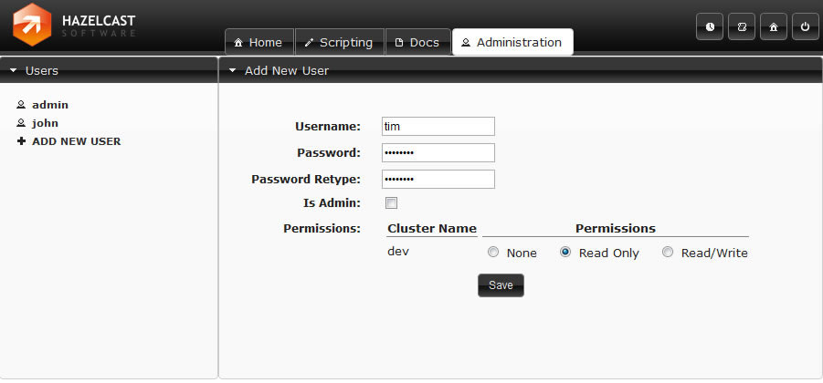

### Tool Overview

The starter page of the tool is`Cluster Home`. Here you can see cluster's main properties such as uptime, memory. Also with pie chart, you can see the distribution of partitions over cluster members. You can come back to this page, by clicking the `Home` icon on the top-right toolbar. On the left panel you see the Map/Queue/Topic instances in the cluster. At the bottom-left corner, members of the cluster are listed. On top menu bar, you can change the current tab to`Scripting, Docs`, user`Administration`. Note that Administration tab is viewable only for admin users. Also `Scripting` page is disabled for users with read-only credential.

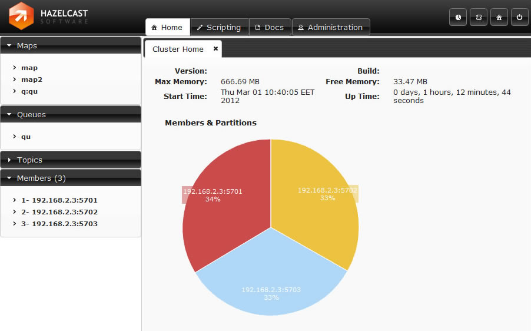


## Maps

Map instances are listed on the left panel. When you click on a map, a new tab for monitoring this map instance is opened on the right. In this tab, you can monitor metrics also re-configure the map.

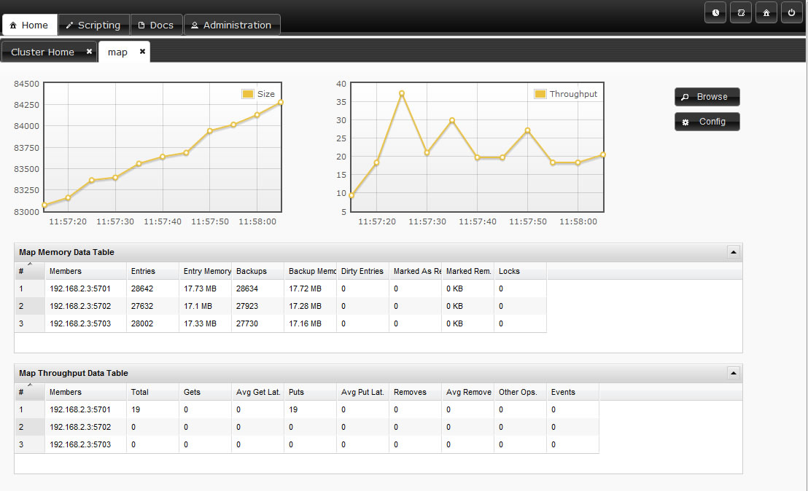

### Monitoring Maps

In map page you can monitor instance metrics by 2 charts and 2 datatables. First data table "Memory Data Table" gives the memory metrics distributed over members. "Throughput Data Table" gives information about the operations performed on instance (get, put, remove) Each chart monitors a type data of the instance on cluster. You can change the type by clicking on chart. The possible ones are: Size, Throughput, Memory, Backup Size, Backup Memory, Hits, Locked Entries, Puts, Gets, Removes...

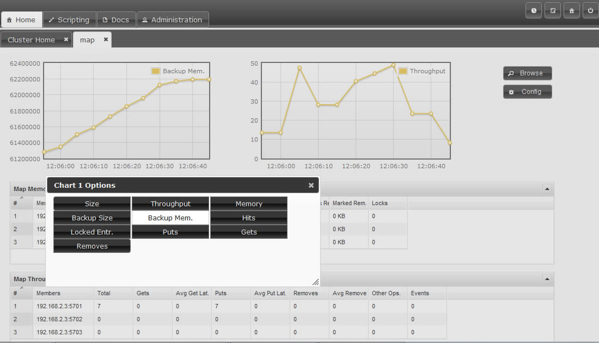

### Map Browser

You can open "Map Browser" tool by clicking "Browse" button on map tab page. Using map browser, you can reach map's entries by keys. Besides its value, extra informations such as entry's cost, expiration time is provided.

[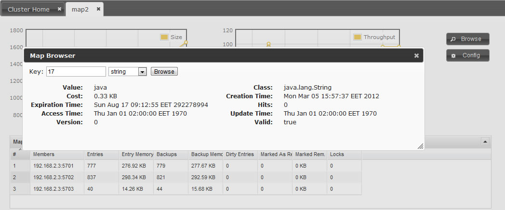](images/mapbrowse.jpg)

### Map Configuration

You can open "Map Configuration" tool by clicking "Config" button on map tab page. This button is disabled for users with Read-Only permission. Using map config tool you can adjust map's setting. You can change backup count, max size, max idle(seconds), eviction policy, cache value, read backup data, backup count of the map.

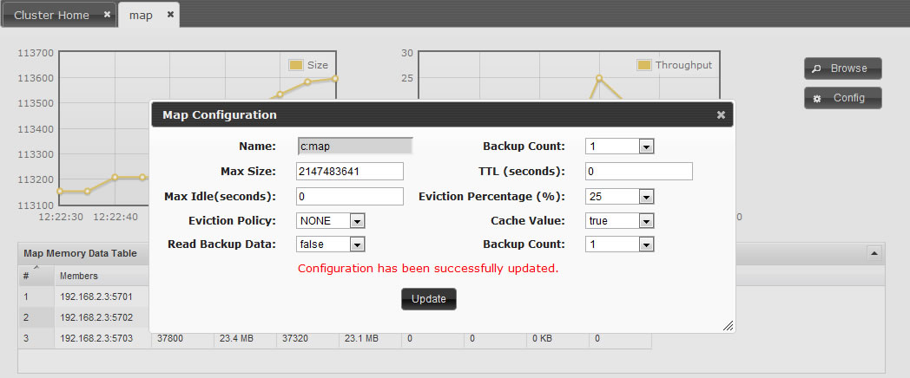


## Queues

Queues is the second data structure that you can monitor in management center. You can activate the Queue Tab by clicking the instance name listed on the left panel under queues part. The queue page consists of the charts monitoring data about the queue. You can change the data to be monitored by clicking on the chart. Available options are Size, Polls, Offers.

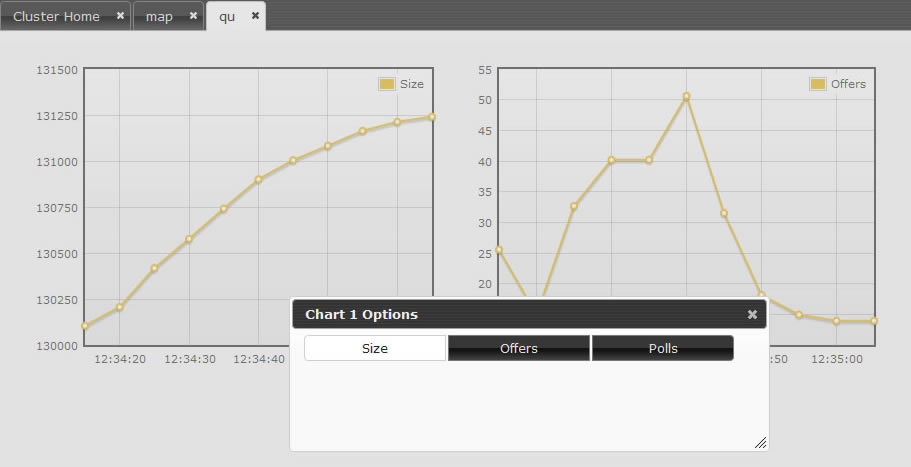


## Topics

You can monitor your topics' metrics by clicking the topic name listed on the left panel under topics part. There are two charts which reflects live data, and a datatable lists the live data distributed among members.

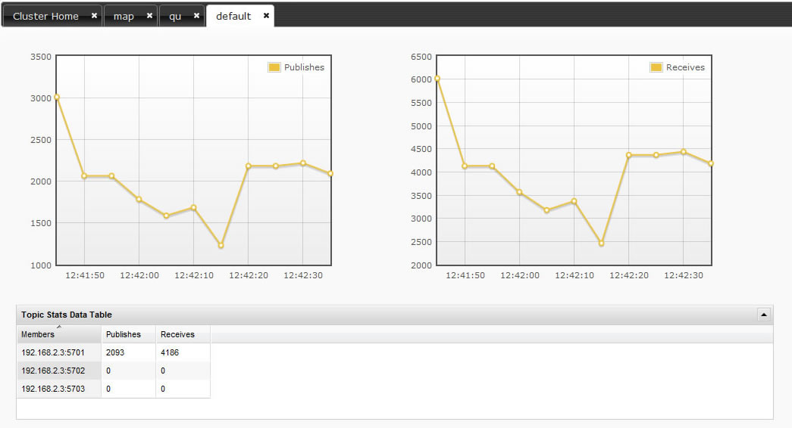


## Members

The current members in the cluster are listed on the bottom side of the left panel. You can monitor each member on tab page displayed by clicking on member items.

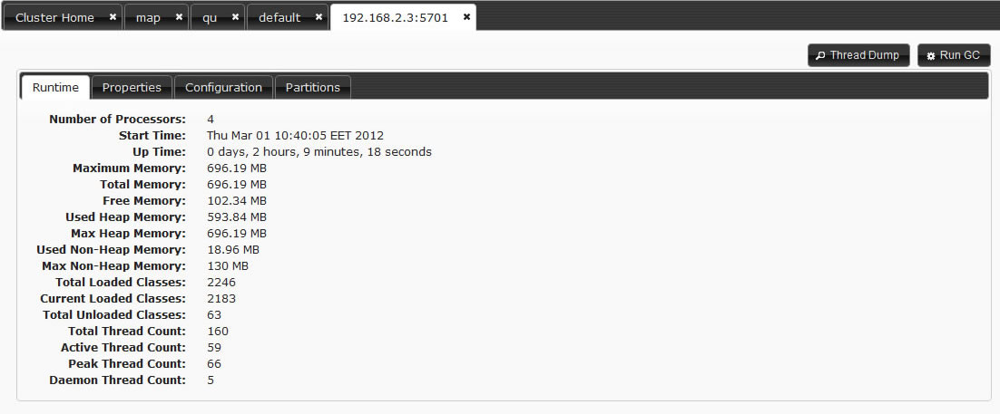

### Monitoring

In members page there are 4 inner tab pages to monitor meber's state and properties. Runtime: Runtime properties about memory, threads are given. This data updates dynamically. Properties: System properties are displayed. Configuration: Configuration xml initially set can be viewed here. Partitions: The partitions belongs to this member are listed.

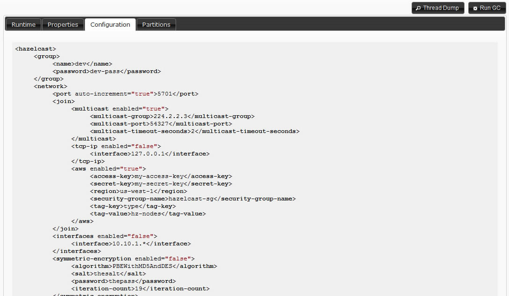

### Operations

Besides monitoring you can perform certain actions on members. You can take thread dump of the member and you can perform garbage collection on the selected member.

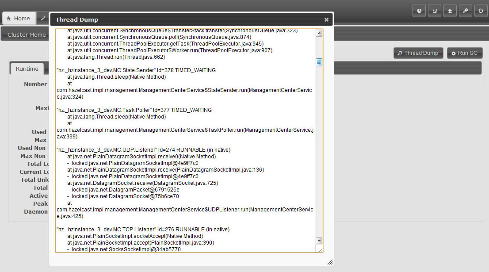


## System Logs

System logs part helps you track internal operations and detect problems. To see system logs first you should set a Log level other than "None". In left menu there are inputs by which you can filter the displayed logs dynamically. Also you can Export your logs and send the file to Hazelcast support team, so they can analyze and help you solving your problem.

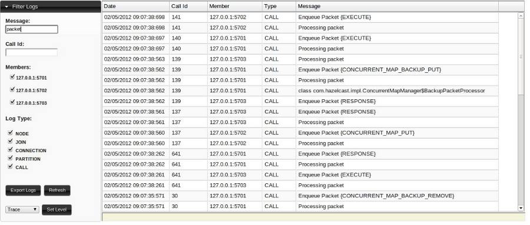


## Scripting

In scripting part, you can execute your own code on your cluster. In the left part you can select members, on which the code will be executed. Also you can select over scripting languages: Javascript, Groovy, JRuby, BeanShell. This part is only enabled for users with read/write permissions for current cluster.


## Time Travel

Time Travel mode is activated by clicking clock icon on top right toolbar. In time travel mode, the time is paused and the full state of the cluster is displayed according the time selected on time slider. You can change time either by Prev/Next buttons or sliding the slider. Also you can change the day by clicking calendar icon. Management center stores the states in you local disk, while your web server is alive. So if you slide to a time when you do not have data, the reports will be seen as empty.

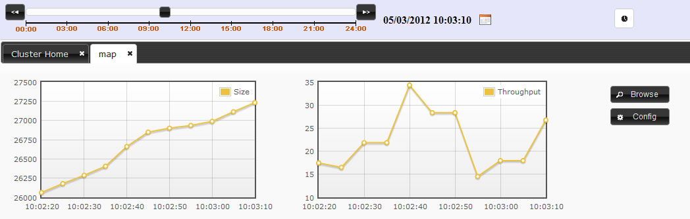


## Console

The console tool enables you execute commands on the cluster. You can read or write on instances but first you should set namespace. For example if you have a map with name "mapCustomers". To get a customer with key "Jack" you should first set the namespace with command "ns mapCustomers". Then you can take the object by "m.get Jack" Here is the command list:

```
-- General commands
echo true|false                      //turns on/off echo of commands (default false)
silent true|false                    //turns on/off silent of command output (default false)
#<number> <command>                  //repeats <number> time <command>, replace $i in <command> with current iteration (0..<number-1>)
&<number> <command>                  //forks <number> threads to execute <command>, replace $t in <command> with current thread number (0..<number-1>
     When using #x or &x, is is advised to use silent true as well.
     When using &x with m.putmany and m.removemany, each thread will get a different share of keys unless a start key index is specified
jvm                                  //displays info about the runtime
who                                  //displays info about the cluster
whoami                               //displays info about this cluster member
ns <string>                          //switch the namespace for using the distributed queue/map/set/list <string> (defaults to "default"
@<file>                              //executes the given <file> script. Use '//' for comments in the script

-- Queue commands
q.offer <string>                     //adds a string object to the queue
q.poll                               //takes an object from the queue
q.offermany <number> [<size>]        //adds indicated number of string objects to the queue ('obj<i>' or byte[<size>])
q.pollmany <number>                  //takes indicated number of objects from the queue
q.iterator [remove]                  //iterates the queue, remove if specified
q.size                               //size of the queue
q.clear                              //clears the queue

-- Set commands
s.add <string>                       //adds a string object to the set
s.remove <string>                    //removes the string object from the set
s.addmany <number>                   //adds indicated number of string objects to the set ('obj<i>')
s.removemany <number>                //takes indicated number of objects from the set
s.iterator [remove]                  //iterates the set, removes if specified
s.size                               //size of the set
s.clear                              //clears the set

-- Lock commands
lock <key>                           //same as Hazelcast.getLock(key).lock()
tryLock <key>                        //same as Hazelcast.getLock(key).tryLock()
tryLock <key> <time>                 //same as tryLock <key> with timeout in seconds
unlock <key>                         //same as Hazelcast.getLock(key).unlock()

-- Map commands
m.put <key> <value>                  //puts an entry to the map
m.remove <key>                       //removes the entry of given key from the map
m.get <key>                          //returns the value of given key from the map
m.putmany <number> [<size>] [<index>]//puts indicated number of entries to the map ('key<i>':byte[<size>], <index>+(0..<number>)
m.removemany <number> [<index>]      //removes indicated number of entries from the map ('key<i>', <index>+(0..<number>)
     When using &x with m.putmany and m.removemany, each thread will get a different share of keys unless a start key <index> is specified
m.keys                               //iterates the keys of the map
m.values                             //iterates the values of the map
m.entries                            //iterates the entries of the map
m.iterator [remove]                  //iterates the keys of the map, remove if specified
m.size                               //size of the map
m.clear                              //clears the map
m.destroy                            //destroys the map
m.lock <key>                         //locks the key
m.tryLock <key>                      //tries to lock the key and returns immediately
m.tryLock <key> <time>               //tries to lock the key within given seconds
m.unlock <key>                       //unlocks the key

-- List commands:
l.add <string>
l.add <index> <string>
l.contains <string>
l.remove <string>
l.remove <index>
l.set <index> <string>
l.iterator [remove]
l.size
l.clear
-- IAtomicLong commands:
a.get
a.set <long>
a.inc
a.dec
-- Executor Service commands:
execute <echo-input>                //executes an echo task on random member
execute0nKey    <echo-input> <key>      //executes an echo task on the member that owns the given key
execute0nMember <echo-input> <key>  //executes an echo task on the member with given index
execute0nMembers <echo-input>       //executes an echo task on all of the members
```
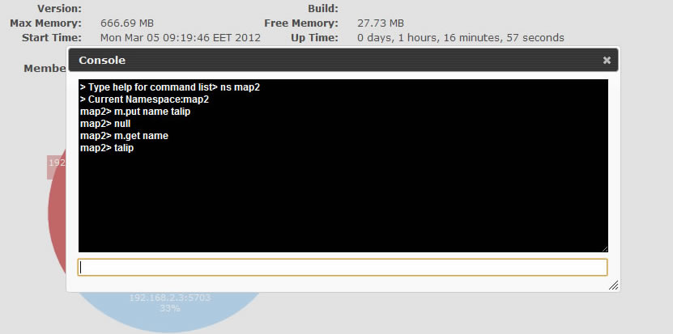


# Miscellaneous 


## Common Gotchas

Hazelcast is the distributed implementation of several structures that exist in Java. Most of the time it behaves as you expect. However there are some design choices in Hazelcast that violate some contracts. This page will list those violations.

1.  **equals() and hashCode() methods for the objects stored in Hazelcast**

    When you store a key, value in a distributed Map, Hazelcast serializes the key and value and stores the byte array version of them in local ConcurrentHashMaps. And this ConcurrentHashMap uses the equals and hashCode methods of byte array version of your key. So it does not take into account the actual equals and hashCode implementations of your objects. So it is important that you choose your keys in a proper way. Implementing the equals and hashCode is not enough, it is also important that the object is always serialized into the same byte array. All primitive types, like; String, Long, Integer and etc. are good candidates for keys to use in Hazelcast. An unsorted Set is an example of a very bad candidate because Java Serialization may serialize the same unsorted set in two different byte arrays.

    Note that the distributed Set and List stores its entries as the keys in a distributed Map. So the notes above apply to the objects you store in Set and List.

2.  Hazelcast always return a clone copy of a value. Modifying the returned value does not change the actual value in the map (or multimap or list or set). You should put modified value back to make changes visible to all nodes.

```java
V value = map.get(key);
value.updateSomeProperty();
map.put(key, value);
```
    If `cache-value` is true (default is true), Hazelcast caches that returned value for fast access in local node. Modifications done to this cached value without putting it back to map will be visible to only local node, successive `get` calls will return the same cached value. To reflect modifications to distributed map, you should put modified value back into map.

3.  Collections which return values of methods such as `IMap.keySet`, `IMap.values`, `IMap.entrySet`, `MultiMap.get`, `MultiMap.remove`, `IMap.keySet`, `IMap.values`, contain cloned values. These collections are NOT backup by related Hazelcast objects. So changes to the these are **NOT** reflected in the originals, and vice-versa.

4.  Most of the Hazelcast operations throw an `RuntimeInterruptedException` (which is unchecked version of `InterruptedException`) if a user thread is interrupted while waiting a response. Hazelcast uses RuntimeInterruptedException to pass InterruptedException up through interfaces that don't have InterruptedException in their signatures. Users should be able to catch and handle `RuntimeInterruptedException` in such cases as if their threads are interrupted on a blocking operation.

5.  Some of Hazelcast operations can throw `ConcurrentModificationException` under transaction while trying to acquire a resource, although operation signatures don't define such an exception. Exception is thrown if resource can not be acquired in a specific time. Users should be able to catch and handle `ConcurrentModificationException` while they are using Hazelcast transactions.


## Testing Cluster

Hazelcast allows you to create more than one member on the same JVM. Each member is called `HazelcastInstance` and each will have its own configuration, socket and threads, so you can treat them as totally separate members. This enables us to write and run cluster unit tests on single JVM. As you can use this feature for creating separate members different applications running on the same JVM (imagine running multiple webapps on the same JVM), you can also use this feature for testing Hazelcast cluster.

Let's say you want to test if two members have the same size of a map.

```java
@Test
public void testTwoMemberMapSizes() {
    // start the first member
    HazelcastInstance h1 = Hazelcast.newHazelcastInstance(null);
    // get the map and put 1000 entries
    Map map1 = h1.getMap("testmap");
    for (int i = 0; i < 1000; i++) {
        map1.put(i, "value" + i);
    }
    // check the map size
    assertEquals(1000, map1.size());
    // start the second member
    HazelcastInstance h2 = Hazelcast.newHazelcastInstance(null);
    // get the same map from the second member
    Map map2 = h2.getMap("testmap");
    // check the size of map2
    assertEquals(1000, map2.size());
    // check the size of map1 again
    assertEquals(1000, map1.size());
}
```
In the test above, everything happened in the same thread. When developing multi-threaded test, coordination of the thread executions has to be carefully handled. Usage of `CountDownLatch` for thread coordination is highly recommended. You can certainly use other things. Here is an example where we need to listen for messages and make sure that we got these messages:

```java
@Test
public void testTopic() {
    // start two member cluster
    HazelcastInstance h1 = Hazelcast.newHazelcastInstance(null);
    HazelcastInstance h2 = Hazelcast.newHazelcastInstance(null);
    String topicName = "TestMessages";
    // get a topic from the first member and add a messageListener
    ITopic<String> topic1 = h1.getTopic(topicName);
    final CountDownLatch latch1 = new CountDownLatch(1);
    topic1.addMessageListener(new MessageListener() {
        public void onMessage(Object msg) {
            assertEquals("Test1", msg);
            latch1.countDown();
        }
    });
    // get a topic from the second member and add a messageListener
    ITopic<String> topic2 = h2.getTopic(topicName);
    final CountDownLatch latch2 = new CountDownLatch(2);
    topic2.addMessageListener(new MessageListener() {
        public void onMessage(Object msg) {
            assertEquals("Test1", msg);
            latch2.countDown();
        }
    });
    // publish the first message, both should receive this
    topic1.publish("Test1");
    // shutdown the first member
    h1.shutdown();
    // publish the second message, second member's topic should receive this
    topic2.publish("Test1");
    try {
        // assert that the first member's topic got the message
        assertTrue(latch1.await(5, TimeUnit.SECONDS));
        // assert that the second members' topic got two messages
        assertTrue(latch2.await(5, TimeUnit.SECONDS));
    } catch (InterruptedException ignored) {
    }
}
```
You can surely start Hazelcast members with different configuration. Let's say we want to test if Hazelcast `LiteMember` can shutdown fine.

```java
@Test(timeout = 60000)
public void shutdownLiteMember() {
    // first config for normal cluster member
    Config c1 = new XmlConfigBuilder().build();
    c1.setPortAutoIncrement(false);
    c1.setPort(5709);
    // second config for LiteMember
    Config c2 = new XmlConfigBuilder().build();
    c2.setPortAutoIncrement(false);
    c2.setPort(5710);
    // make sure to set LiteMember=true
    c2.setLiteMember(true);
    // start the normal member with c1
    HazelcastInstance hNormal = Hazelcast.newHazelcastInstance(c1);
    // start the LiteMember with different configuration c2
    HazelcastInstance hLite = Hazelcast.newHazelcastInstance(c2);
    hNormal.getMap("default").put("1", "first");
    assert hLite.getMap("default").get("1").equals("first");
    hNormal.shutdown();
    hLite.shutdown();
}
```
Also remember to call `Hazelcast.shutdownAll()` after each test case to make sure that there is no other running member left from the previous tests.

```java
@After
public void cleanup() throws Exception {
    Hazelcast.shutdownAll();
}
```
Need more info? [Check out existing tests.](https://github.com/hazelcast/hazelcast/blob/master/hazelcast/src/test/java/com/hazelcast/impl/ClusterTest.java)
## Planned Features

Random order of planned features.

-   Native C++ Client

-   Ready-to-go Hazelcast Cache Server Image for Amazon EC2

-   Symmetric Encryption and SSL support for Java Client

-   Distributed `java.util.concurrent.DelayQueue` implementation.

-   Distributed Tree implementation.

-   Distributed Tuple implementation.

-   Built-in file based storage.


